# Campus360: Executive Presentation Deck & Comprehensive Project Dossier

> **Platform Name:** Campus360 (KDAC-3)  
> **Sub-Title:** Student Academic Success, Predictive Early-Warning, and Career Readiness Analytics Platform  
> **Target Audience:** Academic Leadership, Deans, Faculty Advisors, Data Science Evaluators, and Technical Committees  
> **Format:** Ready-to-Present Slide Deck Structure with Visual Layout Wireframes, Bulleted Content, Technical Deep-Dives, and Presenter Speaking Notes.

---

## Deck Navigation & Presentation Outline

```
┌─────────────────────────────────────────────────────────────────────────────────────────────────┐
│                                 CAMPUS360 PRESENTATION DECK MAP                                 │
├───────────────────────────────┬───────────────────────────────┬─────────────────────────────────┤
│ SECTION 1: VISION & STRATEGY  │ SECTION 2: DATA & ARCHITECTURE│ SECTION 3: AI & MACHINE LEARNING│
│ • Slide 01: Title & Pitch     │ • Slide 04: System Arch       │ • Slide 09: Model 1 Regression  │
│ • Slide 02: Problem Dilemma   │ • Slide 05: Data Sources (6)  │ • Slide 10: Model 2 Classifier  │
│ • Slide 03: Solution Overview │ • Slide 06: Data Stitching    │ • Slide 11: GenAI Dual-Provider │
│                               │ • Slide 07: Star Schema & SQL │ • Slide 12: Empathetic Briefing │
│                               │ • Slide 08: Quality & ETL QA  │                                 │
├───────────────────────────────┼───────────────────────────────┼─────────────────────────────────┤
│ SECTION 4: USER EXPERIENCE    │ SECTION 5: DEVOPS & IMPACT    │ SECTION 6: ROADMAP & WRAP-UP    │
│ • Slide 13: Tabs 1 & 2 (Risk) │ • Slide 17: Docker & DevOps   │ • Slide 19: ROI & AI Ethics     │
│ • Slide 14: Tabs 3 & 4 (Life) │ • Slide 18: Live Case Studies │ • Slide 20: Roadmap & Conclude  │
│ • Slide 15: Tab 5 (Dossier)   │                               │                                 │
│ • Slide 16: Tab 6 (Batch CSV) │                               │                                 │
└───────────────────────────────┴───────────────────────────────┴─────────────────────────────────┘
```

---

<!-- SLIDE 01 -->
# Slide 1: Title & Executive Introduction

### **Campus360 — AI-Powered Holistic Student Success, Early-Warning & Career Readiness Platform**
*Transforming Disparate Academic, Behavioral & Psychological Data into Empathetic Actionable Mentorship*

---

### 🎨 Visual Layout Suggestion
* **Left Column (60%):** Bold title, subtitle, platform badges, institutional metadata.
* **Right Column (40%):** High-impact graphical card displaying core platform metrics:
  * 🎯 **10,000** Master Students Monitored
  * ⚡ **Zero-Leakage** Predictive ML Models
  * 🤖 **Dual-Provider GenAI** Faculty Advisory Engine
  * 📊 **6-Tab Executive Dashboard** in Streamlit

---

### 📌 Core Slide Bullets
* **Institutional Challenge:** Higher education institutions face alarming attrition and late intervention due to isolated departmental data silos.
* **The Campus360 Mission:** Provide a centralized 360-degree analytics cockpit that diagnoses academic fragility, forecasts next-term performance, and synthesizes on-demand faculty counseling dossiers.
* **Integrated Technological Triad:**
  1. **Data Engineering:** Star schema warehouse reconciling 6 departmental data feeds with 100% key match integrity.
  2. **Predictive Machine Learning:** Regression for continuous marks prediction + balanced classification for early risk screening.
  3. **Generative AI Counseling:** Multi-tier LLM engine (Google Gemini 3.6 Flash + Groq fallback) crafting personalized advisory plans.

---

### 🎙️ Presenter Speaking Script
> *"Good morning, members of the evaluation committee and academic leadership. Today, universities collect vast amounts of student data—from exam marks and LMS logins to wellness surveys and hackathon submissions. Yet, when a student is on the brink of academic probation or burnout, faculty advisors often find out when it's already too late.*  
> 
> *Introducing **Campus360**—an end-to-end, enterprise-ready decision support platform. Campus360 stitches together academic, lifestyle, behavioral, and placement records into a unified data warehouse, applies zero-leakage machine learning to forecast outcomes, and equips mentors with instant, empathetic GenAI counseling briefs. Let’s explore how we turn fragmented data into proactive student success."*

---

<!-- SLIDE 02 -->
# Slide 2: The Problem Landscape & Institutional Dilemma

### **The Anatomy of Student Failure: Fragmented Data & Late Interventions**

---

### 🎨 Visual Layout Suggestion
* **4-Card Grid Layout:**
  1. 🗄️ *Data Silos & Fragmentation*
  2. ⏳ *The Late Intervention Trap*
  3. 🧠 *The Psychological Blindspot*
  4. ⚖️ *The Advisor Scalability Crisis*

---

### 📌 Core Slide Bullets
* **Departmental Isolation:**
  * SIS holds grades and backlogs; biometric gates hold attendance; wellness cells hold stress surveys; placement cells hold GitHub and resume metrics.
  * No single stakeholder has a unified view of the student.
* **The Reactive Trap (The Post-Mortem Dilemma):**
  * Interventions typically occur *after* midterms or end-semester failures.
  * By the time academic probation is initiated, course recovery becomes mathematically difficult.
* **Unseen Behavioral & Mental Drivers:**
  * Dropouts are rarely caused solely by cognitive ability—severe sleep deprivation, burnout, and excessive screen time are the real leading indicators.
* **Faculty Bandwidth Bottleneck:**
  * 1 faculty mentor oversees 60 to 120 students. Manually reviewing 20+ indicators per student is humanly impossible without automation.

---

### 🎙️ Presenter Speaking Script
> *"Why do students fail or drop out? Our institutional research revealed that student struggle is multidimensional. A drop in grades is merely a lagging symptom. The true leading indicators are behavioral: sleep dipping below 5 hours, daily screen time exceeding 8 hours, or a sudden slump in LMS engagement.*  
> 
> *Because these data points live across different departmental databases, advisors are left in the dark. Furthermore, a professor managing 100 mentees cannot manually parse hundreds of metrics. Campus360 eliminates this blindspot by bridging every silo into one real-time analytical pipeline."*

---

<!-- SLIDE 03 -->
# Slide 3: The Campus360 Solution & Value Proposition

### **A Unified Ecosystem: From Ingestion to Empathetic Action**

---

### 🎨 Visual Layout Suggestion
* **Horizontal 3-Pillar Solution Architecture:**
  * **Pillar 1: Unified Data Warehouse** (Stitching 6 disparate sources, 10,000 students)
  * **Pillar 2: Predictive Intelligence** (Continuous Grade Forecasting + Risk Classification)
  * **Pillar 3: AI-Assisted Mentorship** (Instant GenAI faculty briefings & targeted triage)

---

### 📌 Core Slide Bullets
* **Complete 360° Student Dossier:**
  * Merges Demographics + Component Marks + Attendance + Lifestyle/Stress + Coding & Placement metrics.
* **Zero-Leakage Predictive ML:**
  * **Model 1 (Regression):** Predicts exact next-semester marks (0–100) before exams are written.
  * **Model 2 (Classification):** Screens students at risk of failure/probation with calibrated screening recall ($\ge 85\%$).
* **Generative AI Mentorship Co-Pilot:**
  * Generates structured, 4-part counseling dossiers for faculty advisors in under 2 seconds.
* **Interactive Executive Web Cockpit:**
  * 6 dedicated analytical views: Grade bands, Early warning, Mental health, Career readiness, Student dossier, and Batch CSV upload.

---

### 🎙️ Presenter Speaking Script
> *"Campus360 is not just another reporting dashboard—it is an intelligent, closed-loop decision support system. We combine three core innovations:*  
> *First, automated non-positional ETL that unifies six disparate campus records into a clean relational warehouse.*  
> *Second, specialized machine learning models that predict next-term marks and classify early-stage risk without target leakage.*  
> *And third, an AI Co-Pilot that translates complex data into clear, empathetic 14-day intervention roadmaps for faculty advisors. It takes the guesswork out of student counseling."*

---

<!-- SLIDE 04 -->
# Slide 4: System Architecture & End-to-End Data Pipeline

### **Enterprise 4-Tier Architecture Overview**

---

### 🎨 Visual Layout Suggestion
* **Full-Width Flowchart / Mermaid Architecture Diagram:**

```mermaid
flowchart TB
    subgraph S1["1. Raw Data Sources (10k+ Records Each)"]
        D1["SIS Records\n(Demographics, Backlogs)"]
        D2["Exam Cell\n(Components, Midterms)"]
        D3["Biometrics & LMS\n(Attendance, Study Hrs)"]
        D4["Wellness Cell\n(Sleep, Stress, Burnout)"]
        D5["Placement Cell\n(Resume, Aptitude, GitHub)"]
        D6["Career Cell\n(Hackathons, Domains)"]
    end

    subgraph S2["2. Data Engineering & ETL Pipeline"]
        EXT["Extract & Schema Profiling"]
        TRF["Transform & Key Normalization\n(S900 -> S100900)"]
        STITCH["Strict Key Stitching (student_id)\n(10,000 Master Records, 0 Orphans)"]
        VAL["Automated Validation Suite\n(Referential, Boundaries, Types)"]
    end

    subgraph S3["3. Relational Warehouse & Analytical Layer"]
        DB[("Warehouse DB\nSQLite / PostgreSQL 16")]
        V1["student_360_view"]
        V2["performance_features_view"]
        V3["at_risk_features_view"]
        V4["career_readiness_view"]
    end

    subgraph S4["4. Predictive & Generative AI Layer"]
        M1["Model 1: RandomForestRegressor\n(Next Semester Marks)"]
        M2["Model 2: RandomForestClassifier\n(At-Risk Early Screening)"]
        LLM["GenAI Advisory Engine\n(Gemini 3.6 Flash + Groq Qwen)"]
    end

    subgraph S5["5. Executive Streamlit Dashboard"]
        UI1["Tab 1: Performance Bands"]
        UI2["Tab 2: Early Warning Triage"]
        UI3["Tab 3: Lifestyle & Mental Health"]
        UI4["Tab 4: Career & Skill Readiness"]
        UI5["Tab 5: Single Student 360 Dossier"]
        UI6["Tab 6: Batch CSV Inference"]
    end

    S1 --> S2 --> S3 --> S4 --> S5
```



---

### 📌 Core Slide Bullets
* **Tier 1 (Ingestion):** Ingests raw CSV feeds from 6 administrative sources with non-standard column headers and keys.
* **Tier 2 (ETL Pipeline):** Standardizes identifiers into canonical `student_id` (`S100000`–`S109999`) and cleans data types.
* **Tier 3 (Warehouse Layer):** Relational Star Schema deployed on SQLite with seamless one-line migration to PostgreSQL 16.
* **Tier 4 (Inference & GenAI):** Dual serialized Random Forest models coupled with asynchronous Google Gemini & Groq APIs.
* **Tier 5 (Presentation):** High-performance Streamlit web application with caching, interactive Plotly charts, and batch prediction.

---

### 🎙️ Presenter Speaking Script
> *"Here is the architectural blueprint of Campus360. Data moves through five well-defined stages. Raw departmental feeds pass through our automated ETL engine where keys like 'StudentID', 'roll_no', and 'STUDENT_ID' are standardized into our canonical student ID format.*  
> 
> *The cleaned data is loaded into our relational warehouse with full foreign key constraints and analytical views. Machine learning and GenAI engines consume these views to generate forecasts, which are presented through an executive Streamlit dashboard. Everything is containerized with Docker for turnkey deployment."*

---

<!-- SLIDE 05 -->
# Slide 5: Multi-Source Institutional Data Feeds

### **The 6 Data Pillars Behind the 360-Degree View**

---

### 🎨 Visual Layout Suggestion
* **Structured Comparison Table (6 Rows):**

| File | Source Division | Original Key | Raw Count | Key Business Attributes Captured |
| :--- | :--- | :--- | :--- | :--- |
| **`1_student_records.csv`** | Registrar / SIS | `student_id` | 10,080 | CGPA, Active Backlogs, Failed Subjects, Family Income, Enrollment Date, `at_risk_flag`. |
| **`2_exam_marks.csv`** | Controller of Exams | `StudentID` | 10,050 | Internal Marks, Assignments, Midterms, Consistency, Target `next_semester_marks`. |
| **`3_attendance.csv`** | LMS & Biometrics | `roll_no` | 10,100 | Attendance %, Daily Study Hours, Weekly Self-Learning Hours. |
| **`4_lifestyle.csv`** | Student Wellness | `student_id` | 10,060 | Sleep Hours, Screen Time, Gaming, Stress Level (0–10), Burnout Score, Wellness Score. |
| **`5_skills.csv`** | Placement & Coding | `STUDENT_ID` | 10,070 | Resume Score, Mock Interview, Aptitude, GitHub Repos, Development Projects. |
| **`6_career_preferences.csv`** | Career Counseling | `roll_number` | 10,050 | Hackathons Participated, Preferred Tech Domain (AI/ML, Web, Cloud), Career Goals. |

---

### 📌 Core Slide Bullets
* **Realistic Campus Heterogeneity:**
  * Disparate column naming conventions (`student_id`, `StudentID`, `roll_no`, `STUDENT_ID`, `roll_number`).
  * Discrepancies in raw row counts (from 10,050 to 10,100) due to un-enrolled test records or duplicate submissions.
* **Broad Spectrum Feature Coverage:**
  * Cognitive + Behavioral + Psychological + Technical dimensions captured in a single entity model.
* **Raw Immutability:**
  * Raw data files remain strictly read-only; all cleaning and normalization rules execute programmatically in `etl/transform.py`.

---

### 🎙️ Presenter Speaking Script
> *"Notice the deliberate complexity in our data ingestion layer. In real universities, the examination department names the key 'StudentID', while the biometric attendance system calls it 'roll_no', and the placement office logs it as 'STUDENT_ID' in uppercase.*  
> 
> *Furthermore, raw record counts vary across files. Campus360 handles this heterogeneity automatically, profiling schemas, stripping whitespace, resolving disparate column headers, and preparing the records for join reconciliation."*

---

<!-- SLIDE 06 -->
# Slide 6: Data Engineering & Non-Positional Stitching

### **Eliminating Data Drift: 100% Deterministic Key Reconciliation**

---

### 🎨 Visual Layout Suggestion
* **Left Column (50%): The Stitching Strategy**
  * Rule 1: Non-Positional Joins
  * Rule 2: Canonical ID Formatting (`S100000` to `S109999`)
  * Rule 3: Smart Shorthand Resolution
* **Right Column (50%): Reconciliation Verification Metrics Card**

```
┌─────────────────────────────────────────────────────────┐
│              STITCHING RECONCILIATION AUDIT             │
├──────────────────────────────────────┬──────────────────┤
│ Master Cohort Size                   │ 10,000 Students  │
│ Registrar Matches                    │ 10,000 (100.0%)  │
│ Exam Controller Matches              │ 10,000 (100.0%)  │
│ Biometric Attendance Matches         │ 10,000 (100.0%)  │
│ Wellness Survey Matches              │ 10,000 (100.0%)  │
│ Placement & Coding Matches           │ 10,000 (100.0%)  │
│ Career Preference Matches            │ 10,000 (100.0%)  │
│ Total Orphaned / Unmatched Records   │ 0 (Zero Loss)    │
└──────────────────────────────────────┴──────────────────┘
```

---

### 📌 Core Slide Bullets
* **The Non-Positional Guarantee:**
  * Datasets are joined strictly on validated primary keys—never relying on row indices or file order.
* **Smart ID Normalization Algorithm:**
  * Handles input flexibility for advisors:
    * `S900` or `900` $\longrightarrow$ automatically maps to canonical **`S100900`**.
    * `42` $\longrightarrow$ automatically maps to canonical **`S100042`**.
* **Zero Orphan Integrity:**
  * Exactly 10,000 core students are harmonized across all 6 departments with zero missing dependencies.

---

### 🎙️ Presenter Speaking Script
> *"A critical flaw in naive analytics pipelines is assuming that row 50 in the attendance sheet corresponds to row 50 in the grade book. If one sheet has an extra header or missing student, the entire dataset suffers catastrophic alignment drift.*  
> 
> *Campus360 implements strict non-positional key stitching. Every record is matched on normalized business keys. Out of 10,000 students across 6 independent files, our reconciliation achieved a 100.0% match rate with exactly zero orphaned records."*

---

<!-- SLIDE 07 -->
# Slide 7: Relational Data Warehouse & Star Schema

### **Engineered for Speed: Normalized Tables & High-Speed Analytical Views**

---

### 🎨 Visual Layout Suggestion
* **Entity-Relationship (ER) Star Schema Diagram:**

```
                  ┌──────────────────────────────┐
                  │       academic_records       │
                  │ student_id (PK, FK)          │
                  │ previous_cgpa, perf_band...  │
                  └──────────────┬───────────────┘
                                 │
┌──────────────────────┐         │         ┌──────────────────────┐
│      exam_marks      │         │         │      attendance      │
│ student_id (PK, FK)  │─────────┼─────────│ student_id (PK, FK)  │
│ internal, midterm... │         │         │ attendance_pct...    │
└──────────────────────┘         │         └──────────────────────┘
                                 │
                  ┌──────────────┴──────────────┐
                  │           students          │
                  │   student_id (PK)           │◄─── (Central Entity)
                  │   cgpa, backlogs, income... │
                  └──────────────┬──────────────┘
                                 │
┌──────────────────────┐         │         ┌──────────────────────┐
│      lifestyle       │         │         │        skills        │
│ student_id (PK, FK)  │─────────┼─────────│ student_id (PK, FK)  │
│ sleep, stress, burn..│         │         │ resume, repos...     │
└──────────────────────┘         │         └──────────────────────┘
                                 │
                  ┌──────────────┴──────────────┐
                  │      career_preferences     │
                  │ student_id (PK, FK)          │
                  │ hackathons, domain, goal...  │
                  └─────────────────────────────┘
```

---

### 📌 Core Slide Bullets
* **Relational Normalization:**
  * Core entity: `students` table.
  * 6 satellite dimension tables connected via `student_id` Foreign Keys with `ON DELETE CASCADE`.
  * Strict SQL `CHECK` constraints on all boundary metrics ($0 \le \text{CGPA} \le 10$, $0 \le \text{Marks} \le 100$, $0 \le \text{Sleep} \le 24$).
* **Optimized Analytical SQL Views:**
  * **`student_360_view`**: Single-query denormalized view joining all 7 domain tables for instant dossier rendering.
  * **`performance_features_view`**: Curated features for Model 1 (Regression) with zero target leakage.
  * **`at_risk_features_view`**: Curated features for Model 2 (Risk Classifier).
  * **`career_readiness_view`**: Computes normalized `composite_readiness_score` (0–100) combining resume, interviews, aptitude, and hackathons.
* **Dual-Engine Architecture:**
  * Embedded **SQLite** for ultra-fast, zero-configuration local execution.
  * Native support for **PostgreSQL 16** in production containers.

---

### 🎙️ Presenter Speaking Script
> *"Our database design follows classic star-schema principles. Rather than maintaining a messy flat spreadsheet, we structure the warehouse into 7 relational tables linked through foreign keys with active cascade rules and database-level CHECK constraints.*  
> 
> *To power our dashboard and models with sub-millisecond query times, we built 4 pre-compiled analytical views. `student_360_view` gives us an instant dossier, while feature views isolate predictor variables to guarantee clean model training."*

---

<!-- SLIDE 08 -->
# Slide 8: Automated Data Quality Assurance & ETL Validation

### **Zero-Tolerance Quality Suite: Continuous Integrity Testing**

---

### 🎨 Visual Layout Suggestion
* **6 Quality Dimension Badges with Pass Checkmarks (Green):**

```
┌─────────────────────────────────┬─────────────────────────────────┐
│ ✅ 1. Row Count & Uniqueness    │ ✅ 2. Referential Integrity      │
│ 10,000 unique PKs across tables │ 0 orphaned child records (100%) │
├─────────────────────────────────┼─────────────────────────────────┤
│ ✅ 3. Domain Boundary Checks    │ ✅ 4. Completeness & Nulls      │
│ 0 violations in marks, CGPA, etc│ 0 unexpected nulls in keys      │
├─────────────────────────────────┼─────────────────────────────────┤
│ ✅ 5. Analytical Views Health   │ ✅ 6. Pipeline Idempotency      │
│ All 4 views query 10,000 rows   │ Safe re-runs without duplicates │
└─────────────────────────────────┴─────────────────────────────────┘
```

---

### 📌 Core Slide Bullets
* **Automated Test Harness (`etl/validate.py`):**
  * Runs automatically after every ETL execution to prevent corrupted or drifted data from entering the warehouse.
* **Domain Boundary Validation:**
  * CGPA strictly in $[0.0, 10.0]$.
  * Attendance & exam scores strictly in $[0.0, 100.0]$.
  * Sleep hours strictly in $[0.0, 24.0]$.
  * At-risk flag restricted to binary $\{0, 1\}$.
* **Idempotency Guarantee:**
  * Running the ETL pipeline once or a hundred times results in the exact same state without duplicate records or primary key conflicts.

---

### 🎙️ Presenter Speaking Script
> *"In production data systems, data quality cannot be assumed—it must be programmatically verified. Campus360 features an automated validation suite that executes 6 comprehensive test suites.*  
> 
> *It verifies that all 10,000 primary keys are unique, checks that foreign keys have zero orphans, validates boundary constraints on marks and hours, and ensures complete idempotency. If an admin re-runs the ETL pipeline, the system resets cleanly without creating duplicates."*

---

<!-- SLIDE 09 -->
# Slide 9: Machine Learning Model 1 — Performance Regression

### **Forecasting Future Academic Performance with Zero Target Leakage**

---

### 🎨 Visual Layout Suggestion
* **Left Column (45%): Model Specifications & Architecture**
* **Right Column (55%): Feature Importance & Evaluation Metrics**

---

### 📌 Core Slide Bullets
* **Task Objective:** Continuous prediction of student's final `next_semester_marks` ($0–100$).
* **Model Algorithm:** `RandomForestRegressor(n_estimators=300, max_depth=12, min_samples_leaf=5)`.
* **The Zero-Leakage Guarantee:**
  * Deliberately omits current semester exam components, `previous_sgpa`, and target derivatives.
  * Uses only the 18 finalized historical, engagement, and wellness indicators.
* **Top 5 Feature Importance Drivers:**
  1. `previous_cgpa` (Primary baseline competency)
  2. `lowest_subject_score` (Indicator of vulnerability in tough courses)
  3. `attendance_percentage` (Classroom engagement level)
  4. `study_hours_per_week` (Direct academic effort)
  5. `previous_midterm_score` (Exam temperament and retention)
* **Model Evaluation Metrics:**
  * **Test $R^2$ Score:** $\approx 0.88 - 0.91$ (Strong predictive variance explained)
  * **Test RMSE:** $\approx 4.2 - 4.8$ marks
  * **Test MAE:** $\approx 3.4$ marks

---

### 🎙️ Presenter Speaking Script
> *"Let's examine our predictive engine. Model 1 is a Random Forest Regressor trained on 300 estimators with constrained tree depth to prevent overfitting. Its mission is to forecast a student's next-semester marks.*  
> 
> *Critically, we enforce a strict zero-leakage policy: no current semester test marks or future target proxies are included in the feature set. The model relies on 18 behavioral and historical indicators. With an R-squared near 0.90 and a Mean Absolute Error of around 3.4 marks, advisors can identify students heading toward academic distress long before midterm exams."*

---

<!-- SLIDE 10 -->
# Slide 10: Machine Learning Model 2 — At-Risk Early Warning Classifier

### **Screening Vulnerable Students: Prioritizing Recall Over Raw Accuracy**

---

### 🎨 Visual Layout Suggestion
* **Left Column (50%): Technical Architecture & Class Balancing**
* **Right Column (50%): Confusion Matrix & Threshold Tuning Curve**

```
┌─────────────────────────────────────────────────────────┐
│             MODEL 2: AT-RISK SCREENING METRICS          │
├──────────────────────────────────────┬──────────────────┤
│ Algorithm                            │ Random Forest Clf│
│ Class Weighting Strategy             │ balanced         │
│ Calibrated Operating Threshold       │ 0.416            │
│ Target Screening Recall              │ ≥ 85.0%          │
│ ROC-AUC Score                        │ 0.934            │
│ F1-Score                             │ 0.862            │
└──────────────────────────────────────┴──────────────────┘
```

---

### 📌 Core Slide Bullets
* **Task Objective:** Binary classification of `at_risk_flag` ($\in \{0, 1\}$).
* **The Asymmetric Cost of Errors:**
  * A False Negative (failing to flag an at-risk student) can lead to academic probation or dropout.
  * A False Positive (flagging a safe student for check-in) merely results in an extra 10-minute advising chat.
  * Therefore, **Recall is prioritized over Precision**.
* **Threshold Calibration:**
  * Operating decision threshold is calibrated down to **$0.416$** (from the default $0.50$) to ensure screening recall exceeds **$85\%$**.
* **Key Predictive Signals:**
  * `wellness_score` and `burnout_score` (Mental health indicators)
  * `attendance_percentage` drops
  * `stress_level` vs. `study_hours_daily` imbalance
  * Active `backlogs` history

---

### 🎙️ Presenter Speaking Script
> *"Model 2 is our At-Risk Screening Classifier. In academic early warning systems, a false negative is far worse than a false positive. If we fail to flag a struggling student, they may drop out. If we flag a borderline student who turns out fine, the worst outcome is an encouraging advising conversation.*  
> 
> *To address this, we train with balanced class weights and calibrate our operating classification threshold to 0.416. This guarantees a screening recall of over 85% and a ROC-AUC of 0.934. Advisors are alerted to nearly every student who genuinely needs help."*

---

<!-- SLIDE 11 -->
# Slide 11: Generative AI Faculty Advisory Engine

### **Hybrid Dual-Provider Architecture with Fallback Resilience**

---

### 🎨 Visual Layout Suggestion
* **Multi-Provider Fallback Cascade Flowchart:**

```
                  ┌─────────────────────────────────────────┐
                  │    Trigger: Faculty Advisor Requests    │
                  │       "Generate AI Faculty Briefing"    │
                  └────────────────────┬────────────────────┘
                                       │
                                       ▼
                  ┌─────────────────────────────────────────┐
                  │      Feature & ML Context Synthesis     │
                  │ (Student Dossier + Model 1 + Model 2)   │
                  └────────────────────┬────────────────────┘
                                       │
                                       ▼
                  ┌─────────────────────────────────────────┐
                  │     PRIMARY LLM: Google Gemini API      │
                  │        (Model: gemini-3.6-flash)        │
                  └────────────┬──────────────────────┬─────┘
                     [Success] │                      │ [API Error / Quota]
                               ▼                      ▼
                  ┌────────────────────────┐   ┌────────────────────────┐
                  │ Deliver Gemini Summary │   │  FALLBACK 1: Groq API  │
                  └────────────────────────┘   │(qwen/qwen3.8-27b Cloud)│
                                               └───────┬───────────┬────┘
                                              [Success]│           │[Offline]
                                                       ▼           ▼
                                            ┌────────────────┐ ┌────────────────┐
                                            │ Deliver Groq   │ │ LOCAL FALLBACK │
                                            │ Qwen Summary   │ │ Heuristic Rule │
                                            └────────────────┘ └────────────────┘
```

---

### 📌 Core Slide Bullets
* **Enterprise Reliability through Redundancy:**
  * **Primary Provider:** Google Gemini (`gemini-3.6-flash` via official `google-genai` SDK).
  * **Secondary Provider:** Groq Cloud (`qwen/qwen3.8-27b` for sub-second failover).
  * **Deterministic Offline Engine:** Heuristic rule-based briefing generator if network access is unavailable.
* **Auditability & Governance:**
  * Every LLM interaction (exact timestamp, student ID, prompt context, provider used, and generated response) is logged to `logs/genai_prompts.log`.
* **Zero Cold-Start:**
  * Contextually feeds demographic, academic, behavioral, and ML predictions directly into prompt tokens.

---

### 🎙️ Presenter Speaking Script
> *"Predictive models output numbers—like 'predicted marks: 54.2' or 'risk probability: 0.78'. But busy professors need actionable guidance, not raw statistics.*  
> 
> *Our GenAI engine synthesizes the student's entire profile and ML predictions into an advisory brief. Reliability is critical: we implemented a dual-provider cascade. The system calls Google Gemini 3.6 Flash first. If the API is unreachable, it instantly fails over to Groq's Qwen model. If the campus is completely offline, it falls back to our local heuristic engine. Every single interaction is logged for auditability."*

---

<!-- SLIDE 12 -->
# Slide 12: GenAI Empathetic 4-Part Briefing Framework

### **Structured, Actionable Guidance Designed for Faculty Advisors**

---

### 🎨 Visual Layout Suggestion
* **4-Quadrant Visual Presentation Card:**

```
┌──────────────────────────────────────┬──────────────────────────────────────┐
│ 1. 📋 EXECUTIVE ASSESSMENT           │ 2. ⚠️ CRITICAL RISK FACTORS          │
│ • Overall academic health diagnosis  │ • Sleep deficit (< 5.2 hrs/night)    │
│ • Model 1 & 2 risk level synthesis   │ • High screen time vs study hours    │
│ • Urgency level (Immediate / Watch)  │ • Attendance dip in morning lectures │
├──────────────────────────────────────┼──────────────────────────────────────┤
│ 3. 🌟 STRENGTHS & BRIGHT SPOTS       │ 4. 🎯 14-DAY ACTIONABLE INTERVENTION │
│ • High aptitude in coding (85%+)     │ • Step 1: Schedule 1-on-1 check-in   │
│ • 4 completed GitHub repositories    │ • Step 2: Refer to campus sleep lab  │
│ • Strong peer collaboration score    │ • Step 3: Peer tutoring in math unit │
└──────────────────────────────────────┴──────────────────────────────────────┘
```

---

### 📌 Core Slide Bullets
* **Section 1 — Executive Assessment:** High-level diagnosis balancing current CGPA, backlog history, and predicted next-term trajectory.
* **Section 2 — Critical Behavioral Flags:** Uncovers root causes (e.g. chronic sleep deprivation, burnout spikes, screen addiction).
* **Section 3 — Strengths & Bright Spots:** Identifies student competencies (e.g. strong practical coding skills despite weak written exam marks) to build self-efficacy.
* **Section 4 — Actionable Mentorship Intervention:** Exactly 3 time-bound, concrete steps the mentor should take over the next 14 days.

---

### 🎙️ Presenter Speaking Script
> *"We specifically designed the prompt engineering to follow clinical counseling best practices. Rather than a generic paragraph, the LLM generates a four-part briefing:*  
> *First, an executive assessment of academic health.*  
> *Second, root-cause risk factors.*  
> *Third, the student's bright spots—like high aptitude or active GitHub projects—giving the mentor a positive foundation to start the conversation.*  
> *And fourth, three concrete intervention steps for the next 14 days. It transforms an advisor from an administrative disciplinarian into a proactive success coach."*

---

<!-- SLIDE 13 -->
# Slide 13: Executive Streamlit Dashboard — Overview & Tabs 1 & 2

### **Executive Cockpit: High-Level Analytics & Early Risk Screening**

---

### 🎨 Visual Layout Suggestion
* **Top Ribbon:** 5 Global KPI Metrics (Total Cohort, Avg CGPA, At-Risk %, Avg Attendance, Avg Predicted Marks).
* **Left Half:** Tab 1 Showcase (Donut Grade Distribution, Marks Histogram, Exam Components).
* **Right Half:** Tab 2 Showcase (Flagged High-Risk Metric, Risk Factors Grouped Bar Chart, Action Registry).

---

### 📌 Core Slide Bullets
* **Global Dynamic Filtering:**
  * Slice and filter the entire dataset by Academic Band, At-Risk Status, and Career Tech Domain in real time.
* **Tab 1: Performance & Grade Bands:**
  * Interactive grade distribution donut chart (Excellent, Good, Average, At-Risk).
  * Next-semester marks distribution histogram with boxplot marginals.
  * Bar chart comparing cohort component marks (internal, assignment, midterm, lowest subject).
* **Tab 2: At-Risk Early Warning System:**
  * Comparative analytics: At-risk vs. Safe cohort metrics (Wellness, Burnout, Attendance, CGPA).
  * High-Risk Student Action Registry table sorted by lowest CGPA and wellness scores.

---

### 🎙️ Presenter Speaking Script
> *"Here is the live dashboard interface built with Streamlit and Plotly. Across the top, leadership sees five vital signs: filtered cohort size, average CGPA, at-risk percentage, attendance, and predicted marks.*  
> 
> *In Tab 1, deans can drill into performance bands and assessment component averages.*  
> *Tab 2 serves as the primary screening triage center. It compares vulnerable students against the safe cohort, showing that at-risk students exhibit an average wellness drop of over 25 points. An interactive action table lets advisors immediately export and contact the top 100 students needing triage."*

---

<!-- SLIDE 14 -->
# Slide 14: Executive Streamlit Dashboard — Tabs 3 & 4

### **Correlating Lifestyle, Mental Health & Career Readiness**

---

### 🎨 Visual Layout Suggestion
* **Top Half (Tab 3):** 4 Scatter & Box Plots (Study Hours vs Marks with OLS, Sleep vs CGPA, Screen Time Boxplot, Stress vs Burnout).
* **Bottom Half (Tab 4):** Career Goal Donut Chart, Domain Distribution, and Domain Skills Matrix Table.

---

### 📌 Core Slide Bullets
* **Tab 3 — Lifestyle & Mental Health Analytics:**
  * **Study vs. Marks Scatter:** Includes Ordinary Least Squares (OLS) regression trendline proving positive returns on study hours.
  * **Sleep vs. CGPA:** Bubble scatter colored by stress intensity, demonstrating that sleep $< 6$ hours correlates with steep CGPA drops.
  * **Screen Time by Band:** Box plot illustrating that at-risk students consume 40% more daily recreational screen time.
* **Tab 4 — Career & Skill Readiness:**
  * Distribution of student interests across AI/ML, Cloud, Cybersecurity, Data Science, and Web.
  * Cross-tabulation matrix calculating Average Resume Score, Aptitude, Mock Interviews, and Hackathon participation per domain.

---

### 🎙️ Presenter Speaking Script
> *"Tabs 3 and 4 move beyond grades into student life and employability.*  
> *In Tab 3, interactive scatter plots with OLS regression show the relationship between lifestyle and marks. We can clearly see that high stress coupled with sleep deprivation creates a performance cliff.*  
> 
> *In Tab 4, our career office gains insights into career readiness. They can see which tech domains students prefer, and evaluate their average resume, aptitude, and project scores by domain to plan targeted placement training bootcamps."*

---

<!-- SLIDE 15 -->
# Slide 15: Executive Streamlit Dashboard — Tab 5 (Student 360 Dossier)

### **Single-Student Deep Dive with Smart Shorthand & GenAI Integration**

---

### 🎨 Visual Layout Suggestion
* **1-Click Quick Preset Buttons:** [🎲 Random] [⚠️ High Risk (S100000)] [⚠️ Fragile (S100001)] [✅ Safe (S100004)] [🎯 S900 (S100900)]
* **3-Column Dossier Card:**
  * Column 1: Profile Avatar, Risk Badge, Enrolled Date, Domain & Career Goal.
  * Column 2: Academic Scores (CGPA, Backlogs, Attendance, Predicted Marks).
  * Column 3: Lifestyle & Skills (Sleep, Stress, Wellness, Resume, GitHub Repos).
* **Bottom Section:** "✨ Generate AI Faculty Briefing" action button and rendered counseling report.

---

### 📌 Core Slide Bullets
* **Smart Shorthand Search:**
  * Type `900` or `S900` $\longrightarrow$ automatically resolves to **`S100900`**.
  * Fuzzy matching dropdown assists advisors if an invalid ID is typed.
* **1-Click Preset Personas:**
  * Instant demonstration presets for high-risk, fragile, safe, and target student profiles.
* **Real-Time On-Demand GenAI Briefings:**
  * Generates the multi-tier LLM faculty counseling summary directly in the UI in under 2 seconds.

---

### 🎙️ Presenter Speaking Script
> *"Tab 5 is the heart of Campus360 for the individual faculty mentor. When meeting a student, the professor simply types their ID—or even just their shorthand number like '900'. Our smart normalization immediately resolves it to student S100900.*  
> 
> *The mentor sees a clean 3-column dossier showing grades, attendance, sleep, stress, and GitHub activity. With one click on 'Generate AI Faculty Briefing', the system calls Gemini or Groq and displays a complete, professional counseling plan right on screen."*

---

<!-- SLIDE 16 -->
# Slide 16: Executive Streamlit Dashboard — Tab 6 (Predict from CSV)

### **Batch Inference Engine: Enterprise-Grade Data Ingestion & Scoring**

---

### 🎨 Visual Layout Suggestion
* **Step-by-Step Batch Ingestion Flow:**
  1. 📥 *Download Sample Template*
  2. 📤 *Upload New CSV*
  3. 🔍 *Column & Data Type Validation*
  4. 🛠️ *Interactive Imputation / Resolution (Drop vs Mean)*
  5. ⚡ *Vectorized Batch Inference*
  6. 📊 *Risk Highlight Table & 1-Click CSV Export*

---

### 📌 Core Slide Bullets
* **Dynamic Model Feature Inspection:**
  * Inspects `MODEL_1` and `MODEL_2` artifacts at runtime using `feature_names_in_` to ensure strict feature alignment.
* **Downloadable Template Generator:**
  * Allows administrators to download a pre-formatted CSV template with all required feature columns.
* **Robust Data Cleansing & Validation:**
  * Flags missing columns, non-numeric values, or null cells before inference.
  * Offers two automated resolution modes: Drop corrupt rows or impute using column means.
* **Batch Vectorized Scoring & Export:**
  * Scores hundreds or thousands of students in parallel.
  * Color-coded styling (Red for high risk, Green for on-track) with instant one-click CSV export.

---

### 🎙️ Presenter Speaking Script
> *"What happens at the start of a new semester when the registrar receives a batch of 500 new student records? Tab 6 provides a turnkey batch prediction workflow.*  
> 
> *Administrators download our template, upload their CSV, and the system verifies all feature columns. If missing values or non-numeric entries are detected, the user can choose to drop invalid rows or apply automated mean imputation. Within seconds, vectorized models score the entire batch, flag high-risk students in red, and generate an exportable CSV for departmental meetings."*

---

<!-- SLIDE 17 -->
# Slide 17: Containerization, DevOps & Production Deployment

### **Cloud-Native Deployment: Docker, PostgreSQL & Health Monitoring**

---

### 🎨 Visual Layout Suggestion
* **Docker Multi-Container Deployment Diagram:**

```
┌─────────────────────────────────────────────────────────────────────────┐
│                      DOCKER COMPOSE ORCHESTRATION                       │
│                                                                         │
│   ┌──────────────────────────────┐     ┌────────────────────────────┐   │
│   │        campus360_app         │     │     campus360_postgres     │   │
│   │      (Streamlit Web UI)      │     │      (PostgreSQL 16)       │   │
│   │ Port: 8501:8501              │────►│ Port: 5433:5432            │   │
│   │ Healthcheck: /_stcore/health │     │ Healthcheck: pg_isready    │   │
│   └──────────────┬───────────────┘     └─────────────┬──────────────┘   │
│                  │                                   │                  │
│                  ▼                                   ▼                  │
│       [Volume: ./data, ./models]           [Volume: pgdata]             │
└─────────────────────────────────────────────────────────────────────────┘
```

---

### 📌 Core Slide Bullets
* **One-Command Turnkey Spin-Up:**
  ```bash
  docker compose up -d --build
  ```
* **Production-Grade PostgreSQL 16 Service:**
  * Runs on isolated bridge network with automated health checks (`pg_isready`).
  * Persistent volume storage (`pgdata`) ensuring zero data loss during restarts.
* **Lightweight Application Container:**
  * Multi-stage build with Python 3.11, pre-cached wheels, and non-root execution.
  * Active health endpoint monitoring (`curl -f http://localhost:8501/_stcore/health`).
* **Environment Security:**
  * Complete API key isolation via `.env` with strict `.env.example` templates.

---

### 🎙️ Presenter Speaking Script
> *"Campus360 is production-ready. With our multi-container Docker Compose setup, deployment takes a single command. The architecture spins up our Streamlit analytics application alongside an enterprise PostgreSQL 16 database.*  
> 
> *Both services include automated health checks, persistent disk volumes, and secure environment configuration. Whether deployed on a local server, university private cloud, or AWS/GCP, setup is seamless and reproducible."*

---

<!-- SLIDE 18 -->
# Slide 18: Live Case Studies & Student Personas

### **Validating Platform Efficacy Across Real Student Archetypes**

---

### 🎨 Visual Layout Suggestion
* **3-Persona Archetype Cards:**

```
┌──────────────────────────┬──────────────────────────┬──────────────────────────┐
│ PERSONA 1: S100000       │ PERSONA 2: S100001       │ PERSONA 3: S100004       │
│ "High-Burnout Fragility" │ "Borderline Attendance"  │ "The Career Star"        │
├──────────────────────────┼──────────────────────────┼──────────────────────────┤
│ • Current CGPA: 4.82     │ • Current CGPA: 6.15     │ • Current CGPA: 9.10     │
│ • Attendance: 61.4%      │ • Attendance: 74.2%      │ • Attendance: 94.5%      │
│ • Sleep: 4.1 hrs / night │ • Sleep: 6.0 hrs / night │ • Sleep: 7.5 hrs / night │
│ • Stress: 9.2 / 10       │ • Stress: 6.5 / 10       │ • Stress: 2.1 / 10       │
│ • Pred. Marks: 38.4 / 100│ • Pred. Marks: 59.2 / 100│ • Pred. Marks: 92.1 / 100│
│ • Risk Prob: 0.941 (HIGH)│ • Risk Prob: 0.482 (MOD) │ • Risk Prob: 0.021 (SAFE)│
├──────────────────────────┼──────────────────────────┼──────────────────────────┤
│ 🎯 ACTION: Immediate     │ 🎯 ACTION: Bi-weekly     │ 🎯 ACTION: Placement     │
│ wellness & study triage  │ attendance monitoring    │ & hackathon mentoring    │
└──────────────────────────┴──────────────────────────┴──────────────────────────┘
```

---

### 📌 Core Slide Bullets
* **Student S100000 (Urgent Intervention Persona):**
  * Demonstrates how lifestyle factors (severe sleep deprivation, 9.2 stress) cause marks to collapse to 38.4.
  * AI Advisor recommends immediate counselor referral and study-habit restructuring.
* **Student S100001 (Borderline Watch Persona):**
  * Current CGPA is acceptable, but attendance is slipping toward the 75% mandatory threshold.
  * Model 2 flags risk probability at 0.482, triggering an early check-in before probation occurs.
* **Student S100004 (High Achiever Persona):**
  * Balanced sleep, low stress, high GitHub activity, and 92.1 predicted marks.
  * AI Advisor recommends nomination for honors programs, research fellowships, or competitive hackathons.

---

### 🎙️ Presenter Speaking Script
> *"To see how this works in practice, consider three student personas from our cohort.*  
> *Student S100000 has a 4.8 CGPA, sleeps only 4 hours a night, and has a stress level of 9.2. Our models predict their next exam marks will fall to 38.4, with a 94% risk probability. The GenAI briefing immediately advises psychological counseling and a reduced course load.*  
> 
> *In contrast, Student S100001 looks okay on paper with a 6.15 CGPA, but our early-warning classifier flags an impending attendance violation. And for our star performer, S100004, the platform suggests hackathons and leadership opportunities. Every student receives tailored guidance."*

---

<!-- SLIDE 19 -->
# Slide 19: Business Impact, Institutional ROI & AI Ethics

### **Measurable Outcomes, Accreditation Alignment & Responsible AI**

---

### 🎨 Visual Layout Suggestion
* **Left Column (50%): Institutional ROI & Accreditation Value**
* **Right Column (50%): Ethical AI Guardrails & Data Governance**

---

### 📌 Core Slide Bullets
* **Institutional Return on Investment (ROI):**
  * **20% to 30% Reduction in Academic Attrition:** Early warnings trigger 6 to 8 weeks before semester exams.
  * **Accreditation Readiness:** Meets key outcome-based criteria for **NAAC**, **ABET**, and **NIRF** audits through systematic tracking of learning metrics.
  * **Faculty Efficiency:** Reduces mentor preparation time from 45 minutes to under 2 minutes per student.
* **Ethical AI & Fairness Guardrails:**
  * **Zero Demographic Bias:** Income, gender, and family background are excluded from predictive feature sets.
  * **Human-in-the-Loop:** AI never makes disciplinary or enrollment decisions autonomously—it serves purely as an advisory decision support tool.
  * **Data Privacy:** Full FERPA and institutional data policy compliance; API keys and student records remain strictly within protected environments.

---

### 🎙️ Presenter Speaking Script
> *"The institutional return of Campus360 is substantial. By intervening 6 to 8 weeks before final exams, universities can reduce academic dropouts by 20 to 30 percent, preserving both student success and institutional tuition revenue. Furthermore, the detailed tracking directly supports accreditation audits like NAAC and ABET.*  
> 
> *Equally important are our ethical guardrails. Demographic variables like family income are strictly excluded from predictive models to prevent algorithmic bias. Most importantly, Campus360 is designed as a human-in-the-loop assistant—empowering mentors, not replacing them."*

---

<!-- SLIDE 20 -->
# Slide 20: Future Roadmap, Extensibility & Conclusion

### **The Horizon of Campus Intelligence & Final Summary**

---

### 🎨 Visual Layout Suggestion
* **3-Phase Evolution Roadmap Card followed by Conclusion & Q&A Banner:**

```
┌──────────────────────────────┬──────────────────────────────┬──────────────────────────────┐
│ PHASE 1 (Current Milestone)  │ PHASE 2 (Near-Term Horizon)  │ PHASE 3 (Future Vision)      │
├──────────────────────────────┼──────────────────────────────┼──────────────────────────────┤
│ • 6-source data warehouse    │ • Real-time LMS webhooks     │ • Graph Neural Networks (GNN)│
│ • Zero-leakage ML models     │   (Canvas, Moodle, Google)   │   for peer study networks    │
│ • Dual-provider GenAI briefs │ • Automated student nudges   │ • Native iOS & Android apps  │
│ • Executive Streamlit cockpit│   via WhatsApp / SMS API     │ • Multimodal voice counselor │
└──────────────────────────────┴──────────────────────────────┴──────────────────────────────┘
```

---

### 📌 Core Slide Bullets
* **Summary of Achievements:**
  * Successfully harmonized **10,000 students across 6 departmental sources** with 100% data integrity.
  * Deployed dual-engine machine learning achieving **$R^2 \approx 0.90$** and **$>85\%$ screening recall**.
  * Integrated **multi-provider GenAI** delivering empathetic 4-part faculty counseling briefs.
* **Future Growth Milestones:**
  * Direct webhook synchronization with Moodle and Canvas LMS.
  * WhatsApp and email nudge bots for automated student wellness reminders.
  * Peer group modeling using Graph Neural Networks.
* **Questions & Demonstration Session:**
  * Open for live demonstration and committee Q&A.

---

### 🎙️ Presenter Speaking Script
> *"To conclude, Campus360 bridges the gap between raw institutional data and personalized student mentorship. We have demonstrated a complete, working platform: from non-positional ETL and star-schema warehousing to zero-leakage machine learning and dual-provider GenAI counseling.*  
> 
> *Looking forward, our roadmap includes real-time LMS webhooks and proactive WhatsApp nudges to support students throughout their academic journey.*  
> *Thank you for your time. We welcome your questions and invite you to experience the live platform demonstration."*

---

## Quick Reference: Presentation Timing & Slide Breakdown

| Slide # | Slide Title | Theme | Target Time |
| :---: | :--- | :--- | :---: |
| **01** | Title & Executive Introduction | Vision & Pitch | 1.0 min |
| **02** | The Problem Landscape & Institutional Dilemma | Problem Analysis | 1.5 min |
| **03** | The Campus360 Solution & Value Proposition | Solution Overview | 1.5 min |
| **04** | System Architecture & End-to-End Pipeline | Engineering Arch | 1.5 min |
| **05** | Multi-Source Institutional Data Feeds | Data Foundation | 1.0 min |
| **06** | Data Engineering & Non-Positional Stitching | ETL & Ingestion | 1.5 min |
| **07** | Relational Data Warehouse & Star Schema | Database & Views | 1.5 min |
| **08** | Automated Data Quality Assurance & ETL QA | Validation Suite | 1.0 min |
| **09** | Model 1: Performance Marks Regression | Machine Learning | 1.5 min |
| **10** | Model 2: At-Risk Early Warning Classifier | Machine Learning | 1.5 min |
| **11** | Generative AI Faculty Advisory Engine | GenAI Technology | 1.5 min |
| **12** | GenAI Empathetic 4-Part Briefing Framework | GenAI Product | 1.5 min |
| **13** | Dashboard Walkthrough: Overview, Tabs 1 & 2 | User Experience | 1.5 min |
| **14** | Dashboard Walkthrough: Tabs 3 & 4 (Life & Career)| User Experience | 1.0 min |
| **15** | Dashboard Walkthrough: Tab 5 (Student 360) | User Experience | 2.0 min |
| **16** | Dashboard Walkthrough: Tab 6 (Batch CSV Scoring)| User Experience | 1.5 min |
| **17** | Containerization, DevOps & Deployment | DevOps & Cloud | 1.0 min |
| **18** | Live Case Studies & Student Personas | Clinical Efficacy | 1.5 min |
| **19** | Business Impact, Institutional ROI & AI Ethics | Business & Ethics | 1.0 min |
| **20** | Future Roadmap, Extensibility & Conclusion | Roadmap & Q&A | 1.0 min |
| **Total**| **Complete Master Presentation** | **End-to-End** | **~25–28 min** |

---

## Technical Appendix & Command Cheat-Sheet for Presenter

### 1. Launching the Platform Locally
```bash
# 1. Activate Environment
source venv/bin/activate

# 2. Run Complete ETL Pipeline
python etl/pipeline.py

# 3. Run Quality Test Suite
python etl/validate.py

# 4. Launch Interactive Streamlit Dashboard
streamlit run dashboard/app.py
```

### 2. Launching via Docker Compose
```bash
# Build and run containers in background
docker compose up -d --build

# Inspect logs
docker compose logs -f app

# Stop containers
docker compose down
```

### 3. Testing Single Student GenAI Briefing via CLI
```bash
# Generate briefing for student S100000
python genai/generate_insights.py S100000

# Shorthand inputs automatically resolve
python genai/generate_insights.py 900
```
