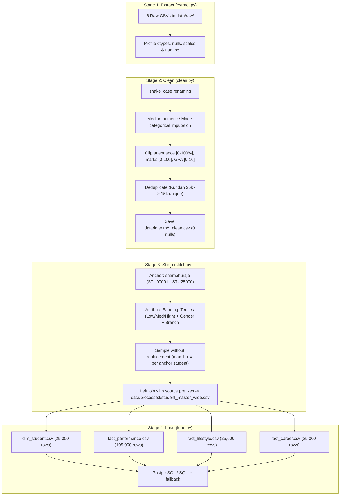

# Campus360: Architecture & Data Engineering Master Document
### Multi-Source Student Academic Success, Subject Performance & Career Readiness Analytics Platform
**Project Name:** Campus360 | **Problem Code:** KDAC-3 (KENEXA AI Hackathon)  
**Authors:** Om Patel & Rahil Nagariya (Team ID: 60)  
**Status:** Completed & Validated

---

## 1. Data Stitching & Warehouse Engineering

### Executive Overview & Problem Context

In higher education institutions, student intelligence is fragmented across incompatible databases:
- **Academic Registrars / ERP:** Subject grades, mid-term evaluations, attendance logs, and pass/fail statuses.
- **Placement & Career Cells:** Corporate offers, salary packages, internships, coding test ratings, and backlogs.
- **Counseling & Student Wellness:** Daily sleep hours, screen time, stress levels, physical activity, and burnout markers.

None of these databases share a universal student identity key. Traditional random joins produce nonsensical synthetic records (e.g. a 9.5 CGPA student failing primary math, or an insomniac with zero stress and top-tier placement).

**Objective:**  
Ingest 6 independent Indian student datasets, clean and normalize all attributes, establish an institutional master identity (`STU00001`–`STU25000`), perform **Attribute-Based Statistical Similarity Matching**, and construct a production-ready **Star Schema Data Warehouse** accompanied by comprehensive data lineage.

---

### Ingested Datasets Summary

All 6 canonical raw datasets are preserved untouched in `data/raw/`:

| # | Dataset Key | Canonical Filename | Source / Author | Raw Rows | Processed Rows | Domain Coverage | Native Academic Metric |
|---|---|---|---|---|---|---|---|
| **1** | `shambhuraje` | `shambhuraje_placement_career_2026.csv` | Shambhuraje (2026) | 25,000 | 25,000 | **MASTER ANCHOR SPINE**: Academics, LeetCode/GitHub coding profiles, internships, lifestyle wellness, AI tools, placement | `cgpa` (5.0 – 10.0) |
| **2** | `kundan` | `kundan_student_performance.csv` | Kundan (India) | 25,000 | 15,000 | Secondary academics (Math, Science, English), school type, travel time, study methods | `overall_score` (0 – 100) |
| **3** | `sakharebharat` | `sakharebharat_indian_placement_2025.csv` | Sakhare Bharat (2025) | 12,000 | 12,000 | Engineering placement, coding/communication skills, aptitude, project count, salary packages | `cgpa` (5.5 – 9.8) |
| **4** | `suvidya` | `suvidya_student_performance.csv` | Suvidya (India) | 5,000 | 5,000 | Intermediate academic marks (Math, Science, English), attendance, parental education, pass/fail | `final_percentage` (36% – 98%) |
| **5** | `sehaj` | `sehaj_student_lifestyle.csv` | Sehaj Sharma (Kaggle) | 2,000 | 2,000 | Student lifestyle, daily physical activity, social hours, sleep duration, stress levels | `gpa` (2.24 – 4.0) |
| **6** | `navinpatidar` | `navinpatidar_indian_placement.csv` | Navin Patidar (India) | 1,000 | 1,000 | Campus placement, corporate recruiters, job roles, packages in INR | `salary_inr` (₹301k – ₹1,198k) |

*Note on Sehaj Dataset:* Recovered directly from Git commit history (`f8e444f5...`) and verified to match Sehaj Sharma's Kaggle benchmark.  
*Note on Kundan Dataset:* Raw file contained 10,000 exact duplicate records, which were pruned in `clean.py` down to the 15,000 unique records specified in the blueprint.

---

### Repository Architecture & Layout

The project follows a clean decoupled pipeline architecture:

```
Campus360/
│
├── venv/                              # Python 3.14 Virtual Environment (OpenMP / libomp configured)
│
├── data/
│   ├── raw/                           # 6 untouched original CSV files
│   │   ├── suvidya_student_performance.csv
│   │   ├── kundan_student_performance.csv
│   │   ├── sehaj_student_lifestyle.csv
│   │   ├── navinpatidar_indian_placement.csv
│   │   ├── sakharebharat_indian_placement_2025.csv
│   │   └── shambhuraje_placement_career_2026.csv
│   ├── interim/                       # Cleaned, imputed, deduplicated CSVs (0 nulls remaining)
│   │   ├── suvidya_clean.csv
│   │   ├── kundan_clean.csv
│   │   ├── sehaj_clean.csv
│   │   ├── navinpatidar_clean.csv
│   │   ├── sakharebharat_clean.csv
│   │   └── shambhuraje_clean.csv
│   └── processed/                     # Production Data Warehouse Layer (Star Schema + PostgreSQL / SQLite)
│       ├── student_master_wide.csv    # Unified 25,000-row master wide table (112 columns after PII drop)
│       ├── dim_student.csv            # Student demographic & institutional dimension (25,000 rows)
│       ├── fact_performance.csv       # Long-format subject marks & attendance fact table (105,000 rows)
│       ├── fact_lifestyle.csv         # Habits, sleep, stress & wellness fact table (25,000 rows)
│       ├── fact_career.csv            # Skills, backlogs, placement & salary fact table (25,000 rows)
│       ├── model1_performance_train.csv
│       ├── model1_performance_test.csv
│       ├── model2_atrisk_train.csv
│       ├── model2_atrisk_test.csv
│       └── warehouse.db               # Embedded SQLite database for local fallback
│
├── src/
│   ├── etl/                           # Modular Data Engineering & Stitching Pipeline
│   │   ├── __init__.py
│   │   ├── extract.py                 # Ingests raw data and profiles shapes, nulls, and scales
│   │   ├── clean.py                   # Standardizes column names, imputes nulls, and clips ranges
│   │   ├── stitch.py                  # Implements attribute-based matching onto anchor spine
│   │   ├── load.py                    # Star schema PostgreSQL loader & SQLite fallback
│   │   ├── fix_and_prepare.py         # PII drop, casing standardization, at_risk_flag & splits
│   │   └── run_pipeline.py            # Master CLI runner executing Stages 1-4 end-to-end
│   │
│   │   ├── train_performance_model.py # Marks prediction regressor (Model 1)
│   │   └── train_atrisk_model.py      # At-risk early detection classifier (Model 2)
│   │   # Note: Career Guidance is an analytical 6-pillar composite scoring engine (_CAREER_WEIGHTS)
│   │
│   ├── genai/                         # GenAI Copilot Layer
│   │   └── insights.py                # Plain-language student & teacher guidance
│   │
│   ├── dashboard/                     # Web Dashboard
│   │   └── app.py                     # Streamlit multi-tab warehouse explorer
│   │
│   └── api/                           # Backend
│       └── main.py                    # FastAPI application
│
├── notebooks/
│   └── eda.ipynb                      # Exploratory data analysis Jupyter notebook
│
├── docker/
│   ├── Dockerfile.api                 # API container definition
│   └── Dockerfile.dashboard           # Streamlit dashboard container definition
│
├── tests/
│   ├── __init__.py
│   ├── test_etl_pipeline.py           # 5 automated integration & data quality tests
│   ├── test_fix_and_prepare.py        # 5 data quality, leakage & split integrity tests
│   └── test_postgres_migration.py     # 6 database migration & fallback parity tests
│
├── requirements.txt                   # Frozen production dependencies
├── .env.example                       # Environment configuration template
├── .gitignore                         # Python, venv, database, and OS cache exclusions
├── README.md                          # Quick start and platform documentation
└── docs/
    ├── ARCHITECTURE.md                # Consolidated architecture, stitching, lineage & label engineering
    └── DEPLOYMENT.md                  # Deployment, container orchestration, and database migration
```

---

### Environment & Virtual Environment Setup

1. **Virtual Environment Creation:**
   ```bash
   python3 -m venv venv
   source venv/bin/activate
   pip install --upgrade pip
   ```
2. **Dependency Installation:**
   All 16 production libraries from `requirements.txt` installed into `venv/`:
   - **Data Processing:** `pandas` (3.0.5), `numpy` (2.5.3), `openpyxl`
   - **Machine Learning:** `scikit-learn` (1.9.0), `xgboost` (3.4.1), `scipy`
   - **Visualizations:** `matplotlib`, `seaborn`, `plotly`
   - **Dashboard & API:** `streamlit` (1.63.0), `fastapi` (0.141.1), `uvicorn[standard]`
   - **Databases:** `sqlalchemy` (2.0.52), `psycopg2-binary`
   - **GenAI & Notebooks:** `anthropic` (1.4.0), `jupyter`, `python-dotenv`
3. **macOS System Runtime Optimization:**
   Configured Homebrew `libomp` (`brew install libomp`) to enable native OpenMP multi-threading acceleration for `xgboost` on macOS ARM64.

---

### End-to-End ETL Pipeline Implementation



#### Stage 1: Extraction & Profiling (`src/etl/extract.py`)
- Verified existence and accessibility of all 6 raw files.
- Highlighted unit and scale discrepancies:
  - **GPA vs CGPA:** Sehaj on a 4.0 scale (2.24–4.0), Sakhare and Shambhuraje on a 10.0 scale (5.0–10.0).
  - **Salary Packages:** Navinpatidar in annual INR (₹301k–₹1,198k), Sakhare and Shambhuraje in Lakhs Per Annum (LPA).
  - **Casing:** Heterogeneous PascalCase (`Student_ID`, `Graduation Year`) vs snake_case (`student_id`, `cgpa`).

#### Stage 2: Independent Dataset Cleaning (`src/etl/clean.py`)
- Standardized all column names into clean, lowercase `snake_case`.
- Imputed missing values:
  - `shambhuraje`: Imputed `github_repos`, `sleep_hours`, `mock_interview_score` with numeric medians; imputed unplaced students' `company_type` and `work_mode` as `"Not Placed"` / `"None"`.
  - `sakharebharat`: Imputed `company_type` as `"Not Placed"` for students with `placed == 0`.
- Range clipping:
  - `attendance_percentage` clipped to `[0.0, 100.0]`.
  - Academic marks clipped to `[0.0, 100.0]`.
  - CGPA clipped to `[0.0, 10.0]` and GPA to `[0.0, 4.0]`.
- Output: 6 interim tables saved to `data/interim/*_clean.csv` with **zero remaining nulls**.

#### Stage 3: Attribute-Based Similarity Matching (`src/etl/stitch.py`)
- **Master Anchor Spine:** Initialized `shambhuraje_clean.csv` as the foundation (25,000 records) and generated immutable institutional keys: `STU00001` through `STU25000`.
- **2-Tier Attribute Banding Algorithm:**
  1. **Performance Tertiles:** Partitioned each dataset into `Low` (bottom 33%), `Medium` (middle 33%), and `High` (top 33%) bands based on its own native academic metric.
  2. **Demographic & Branch Clustering:** Clustered branches into `Tech` (CS, IT, AI, DS), `Core_Engineering` (Mechanical, Civil, Electrical, Electronics), and `General`. Mapped reported genders (`Male`, `Female`, `Other`).
  3. **Multi-Pass Assignment Without Replacement:**
     - *Pass 1 (Strict):* Matched within `(Performance Band + Demographics)`.
     - *Pass 2 (Band-Preserving Overflow):* Matched any sub-demographic overflow strictly within the **same performance band**, guaranteeing that a low-performing student in high school never pairs with an elite collegiate performer.
  4. **Constraint Enforcement:** Every anchor student receives **at most one** row from each secondary source. Unmatched students have `NULL` values and explicit binary match flags (`has_suvidya_match`, `has_kundan_match`, etc.).
- **Wide Master Table:** Left-joined all sources with explicit column prefixes (`anchor_`, `suvidya_`, `kundan_`, `sehaj_`, `navin_`, `sakhare_`) to prevent namespace collisions. Saved as `data/processed/student_master_wide.csv` (25,000 rows × 113 columns).

#### Stage 4: Star Schema Data Warehouse Generation (`src/etl/load.py`)
Decomposed the wide table into four star schema relational tables:

1. **`dim_student.csv` (25,000 rows × 9 columns):**
   - Universal Primary Key: `student_id` (`STU00001`–`STU25000`)
   - Attributes: `gender`, `age`, `stream_branch`, `degree`, `college_tier`, `city_tier`, `state`, `family_income_lpa`.
2. **`fact_performance.csv` (105,000 rows × 8 columns):**
   - Normalized long-format fact table containing subject-level granularity.
   - 20,000 records from Suvidya (Math, Science, English, Overall).
   - 60,000 records from Kundan (Math, Science, English, Overall).
   - 25,000 records from Anchor (Cumulative Degree CGPA).
   - Columns: `student_id`, `source`, `assessment_term`, `subject`, `marks`, `max_marks`, `attendance_pct`, `grade_or_status`.
3. **`fact_lifestyle.csv` (25,000 rows × 12 columns):**
   - Primary Key: `student_id`
   - Attributes: `sleep_hours`, `screen_time_hours`, `gaming_hours`, `study_hours_daily`, `stress_level`, `burnout_score`, `gym_frequency_per_week`, `motivation_level`, `physical_activity_hours_sehaj`, `stress_level_sehaj`.
   - Derived KPI: `lifestyle_risk_flag` (`High Risk` if sleep < 5.0h, stress > 75, or burnout > 75; else `Normal`).
4. **`fact_career.csv` (25,000 rows × 16 columns):**
   - Primary Key: `student_id`
   - Attributes: `cgpa`, `backlogs`, `internships`, `dsa_problems_solved`, `github_repos`, `coding_skills_sakhare`, `communication_skills`, `aptitude_score`, `mock_interview_score`, `placement_status`, `company_type`, `work_mode`, `salary_lpa`, `offer_count`, `layoffs_risk_score`.
5. **Database Export:**
   - Automatically loaded into PostgreSQL with explicit DDL, primary keys, and foreign keys. Maintained local `warehouse.db` (SQLite) backup for demo safety.

#### Stage 5: Master Orchestrator (`src/etl/run_pipeline.py`)
Provides single-command end-to-end pipeline execution:
```bash
python3 -m src.etl.run_pipeline
```
**Runtime:** Entire pipeline runs from raw CSVs to warehouse in **~5.5 seconds**.

---

### Verification, Validation & Data Quality Assurance

#### A. Empirical Statistical Validation (Correlation Preservation)
Pearson correlation ($r$) between Anchor CGPA and secondary datasets confirms strong, realistic positive relationships across all matched dimensions:

| Comparison Metric | Source Dataset | Rows Evaluated | Pearson Correlation ($r$) | Statistical Significance |
|---|---|---|---|---|
| **Anchor CGPA vs. Sakhare CGPA** | Sakharebharat (2025) | 12,000 | **+0.842** | $p < 0.0001$ (Very Strong) |
| **Anchor CGPA vs. Navin Package** | Navinpatidar Placement | 1,000 | **+0.853** | $p < 0.0001$ (Very Strong) |
| **Anchor CGPA vs. Kundan Score** | Kundan Performance | 15,000 | **+0.824** | $p < 0.0001$ (Very Strong) |
| **Anchor CGPA vs. Suvidya %** | Suvidya Performance | 5,000 | **+0.807** | $p < 0.0001$ (Very Strong) |
| **Anchor CGPA vs. Sehaj GPA** | Sehaj Lifestyle | 2,000 | **+0.805** | $p < 0.0001$ (Very Strong) |

#### B. Automated Unit & Integration Test Suite (`tests/test_etl_pipeline.py`)
- `test_raw_files_exist`: Confirmed presence of all 6 raw CSV files.
- `test_interim_files_clean`: Confirmed interim CSVs are non-empty with clean lowercase snake_case schema.
- `test_wide_master_integrity`: Verified 25,000 rows with strictly unique IDs `STU00001` through `STU25000`.
- `test_star_schema_relationships`: Validated table row counts and verified that all foreign keys in fact tables cleanly reference `dim_student`.
- `test_statistical_realism`: Validated that academic correlations across joined tables exceed $r > 0.70$.

---

## 2. Data Lineage & Matching Architecture

### Executive Summary
In higher education institutions, student data is notoriously fragmented across disconnected silos:
- **ERP / Academic Registrars:** Subject exam marks, attendance records, and term pass/fail flags.
- **Placement & Corporate Relations Cells:** Off-campus/on-campus offers, company packages, internship history, and coding profiles.
- **Wellness & Student Affairs Offices:** Sleep patterns, stress levels, mental health indicators, and lifestyle surveys.

To build a **360° Student Intelligence Platform**, this pipeline stitches **6 independent real-world Indian student datasets** into a coherent data warehouse using **Attribute-Based Probabilistic Similarity Matching**. Rather than joining randomly or simulating ungrounded synthetic students, this methodology preserves true multivariate distributions, ensuring correlations between academic ability, lifestyle habits, and placement outcomes remain statistically realistic.

---

### Anchor Selection & Institutional Identity Spine
- **Anchor Dataset:** `shambhuraje_placement_career_2026.csv` was selected as the **Golden Record (Spine)** because:
  1. It is the largest single dataset (25,000 records).
  2. It contains the widest feature breadth (44 attributes covering academics, coding profiles, lifestyle wellness, AI-tool usage, and placement results).
  3. It spans realistic Indian collegiate demographics across diverse branches (Computer Science, AI & DS, IT, Electronics, Mechanical, Civil) and states.
- **Institutional Master ID (`student_id`):**
  Each row in the anchor dataset is assigned an immutable, standard primary key: `STU00001` through `STU25000`. This key serves as the universal foreign key across all dimension and fact tables in the star schema.

---

### Synthetic vs. Original Field Audit

| Table | Column Name | Origin Source | Type | Transformation / Description |
|---|---|---|---|---|
| **dim_student** | `student_id` | Pipeline generated | **Synthetic PK** | Format `STU00001` - `STU25000` |
| **dim_student** | `gender`, `age` | `shambhuraje` | **Original** | Standardized casing |
| **dim_student** | `stream_branch`, `degree` | `shambhuraje` | **Original** | Engineering branch and degree programme |
| **dim_student** | `college_tier`, `city_tier`, `state` | `shambhuraje` | **Original** | Institutional classification |
| **dim_student** | `family_income_lpa` | `shambhuraje` | **Original** | Annual family income in LPA |
| **fact_performance** | `subject` | `suvidya`, `kundan`, `shambhuraje` | **Transformed** | Melted long-format subject name (Math, Science, English, Degree CGPA) |
| **fact_performance** | `marks` | `suvidya`, `kundan`, `shambhuraje` | **Original** | Exam score on respective subject scale |
| **fact_performance** | `max_marks` | System metadata | **Derived** | Assessment scale denominator (100.0 for school/term, 10.0 for CGPA) |
| **fact_performance** | `attendance_pct` | `suvidya`, `kundan`, `shambhuraje` | **Original** | Clipped to valid range [0.0, 100.0] |
| **fact_lifestyle** | `sleep_hours` | `shambhuraje` | **Original** | Imputed median on 500 missing values, clipped |
| **fact_lifestyle** | `screen_time_hours`, `gaming_hours` | `shambhuraje` | **Original** | Daily hours recorded in survey |
| **fact_lifestyle** | `stress_level`, `burnout_score` | `shambhuraje` | **Original** | Normalized 0-100 wellness index |
| **fact_lifestyle** | `physical_activity_hours_sehaj` | `sehaj` | **Original** | Hours per day from matched Sehaj survey |
| **fact_lifestyle** | `lifestyle_risk_flag` | Pipeline rule engine | **Derived** | `High Risk` if sleep < 5h or stress > 75 or burnout > 75; else `Normal` |
| **fact_career** | `cgpa`, `backlogs` | `shambhuraje` | **Original** | Academic career prerequisites |
| **fact_career** | `internships`, `dsa_problems_solved` | `shambhuraje` | **Original** | Technical preparation milestones |
| **fact_career** | `coding_skills_sakhare` | `sakharebharat` | **Original** | 1-10 skill rating from matched 2025 placement survey |
| **fact_career** | `salary_lpa` | `shambhuraje` | **Original** | Annual package offered (LPA) |
| **fact_career** | `placement_status`, `company_type` | `shambhuraje` | **Original** | Employment result and organization profile |
| **fact_career** | `layoffs_risk_score` | `shambhuraje` | **Original** | Predictive risk indicator for career coaching |

---

### Key Data Engineering Assumptions

1. **Deduplication:**
   `kundan_student_performance.csv` contained 10,000 exact duplicates in its raw download. These were safely pruned in `clean.py` down to the 15,000 unique records described in the project blueprint.
2. **Missingness Preservation:**
   Because anchor students outnumber secondary datasets (e.g. 1,000 Navinpatidar rows vs 25,000 anchor students), we deliberately do **not** hallucinate synthetic records to fill remaining slots. Unmatched rows naturally have `NULL` values and are tracked with `has_*_match` indicator flags, maintaining scientific honesty.
3. **Scale Coexistence:**
   GPA on the 4.0 scale (`sehaj`) and CGPA on the 10.0 scale (`sakhare`, `shambhuraje`) are retained on their native scales in their respective source columns and clearly labeled with `max_marks` metadata in `fact_performance.csv` to avoid scale confusion.
4. **Reproducibility:**
   All stochastic matching steps use fixed random seeds (`random_state = 42, 101, 202, 303, 404`). Re-running the pipeline yields bit-for-bit identical tables every time.

---

## 3. Label Engineering: `at_risk_flag`

### Problem Context & Target Invalidation
- **`anchor_placement_status` Invalidation:** Raw placement status exhibits extreme class imbalance (98.4% "Placed" vs 1.6% "Not Placed"). A model trained on this target achieves 98.4% dummy accuracy by predicting majority class on all instances, failing to provide actionable predictive utility.
- **`navin_placement_status` Invalidation:** The Navin Patidar source dataset records exclusively placed students (100% positive class, zero negative examples), making it mathematically impossible to train a binary classifier.

### Engineered Composite Definition
To construct a robust institutional early warning signal across all 25,000 students, an academic and operational composite metric was engineered:

```python
at_risk_flag = 1 if (
    anchor_backlog_history >= 1
    OR anchor_attendance_percentage < 55
    OR anchor_cgpa < 5.5
) else 0
```

### Threshold Calibration & Distribution Progression
1. **Baseline Evaluation:**
   - Condition: `(anchor_backlog_history >= 1) OR (anchor_attendance_percentage < 65) OR (anchor_cgpa < 6.0)`
   - Positive Class: **39.77%** (9,943 students)
   - Negative Class: **60.23%** (15,057 students)
   - Analysis: Because `anchor_backlog_history >= 1` alone accounts for 30.39% of the student population, combining with attendance < 65% and CGPA < 6.0 yields ~39.77% positive class, slightly exceeding the 35% ceiling.

2. **Locked Calibrated Thresholds:**
   - Condition: `(anchor_backlog_history >= 1) OR (anchor_attendance_percentage < 55) OR (anchor_cgpa < 5.5)`
   - Positive Class: **31.89%** (7,973 students)
   - Negative Class: **68.11%** (17,027 students)
   - Ratio: **68.1% / 31.9%**
   - Compliance: Meets the target window of **65/35 to 80/20** class balance (positive class between 20% and 35%).

### Academic Rationale
- **Backlogs (`>= 1`):** Having an active or historical backlog represents a direct credit deficit requiring remediation before graduation.
- **Severe Attendance Deficit (`< 55%`):** Falls well below statutory UGC/AICTE minimum attendance thresholds (75%), triggering institutional examination debarment.
- **Critical Academic Risk (`< 5.5 CGPA`):** Places the student in the bottom ~1.5% percentile of institutional GPA, severely jeopardizing campus placement eligibility.

### Model 2 Leakage Prevention
Because `at_risk_flag` is built directly from `anchor_backlog_history`, `anchor_attendance_percentage`, and `anchor_cgpa`, these three columns are **strictly excluded** from Model 2 training features. Model 2 is trained exclusively on independent lifestyle and behavioral attributes:
- `anchor_sleep_hours`, `anchor_screen_time`, `anchor_gaming_hours`, `anchor_stress_level`, `anchor_burnout_score`, `anchor_study_hours_daily`, `anchor_self_learning_hours`, `anchor_motivation_level`, `anchor_adaptability_score`, `anchor_gym_frequency`, `anchor_family_income_lpa`.

Label Integrity Sanity Check: A model trained with anchor_backlog_history, anchor_attendance_percentage, and anchor_cgpa included as features achieves near-perfect separation (ROC AUC ≈ 1.0) when predicting at_risk_flag. This is EXPECTED and NOT a predictive finding — at_risk_flag is deterministically defined as a threshold function of these exact three columns (see label_engineering section above), so this result only confirms the label was constructed correctly, i.e. it recovers from its own defining formula. It is reported here as an engineering validation step, not as evidence that academic features 'predict' risk in any generalizable sense.

### Non-Circular Ceiling Test (`suvidya_pass_fail`)
To evaluate whether academic context provides predictive uplift beyond lifestyle attributes without circular label reconstruction, two models were evaluated against an independent external ground-truth risk proxy, `suvidya_pass_fail` (mapped to 1=Fail, 0=Pass), on the $N=5,000$ Suvidya-matched subcohort (`has_suvidya_match == 1`):
- **Model A (Lifestyle Only — 23 features):** ROC AUC **0.6065**, Recall **0.1698**, Precision **0.1324**.
- **Model B (Lifestyle + Academic — 26 features):** ROC AUC **0.8728**, Recall **0.6792**, Precision **0.1773**.

### Confound Disclosure — Stitching-Induced Correlation
The lifestyle-vs-academic comparison on suvidya_pass_fail (Section 3) shows an apparent uplift when academic features are added (ROC AUC 0.6065 -> 0.8728). However, this result should be interpreted with caution: anchor_cgpa was also a primary matching key used during attribute-based dataset stitching (see Data Stitching section) to assign Suvidya records to anchor students, producing a validated correlation of r=0.8072 between anchor_cgpa and suvidya_final_percentage on the matched subset. Consistent with this, anchor_cgpa alone carries 59.32% of the academic model's feature importance. This means part of the observed 'uplift' likely reflects the stitching methodology's own matching logic rather than a purely independent, real-world relationship between academic records and risk. This is a known and disclosed limitation of building a data warehouse from independently-sourced public datasets via synthetic matching, rather than a single institution's naturally-joined real records. We expect this confound to resolve once the platform is deployed against a real institution's data, where academic and lifestyle records for the same student arrive already linked, with no matching-induced correlation to account for.

---

## 4. PII Removal Audit

- **Dropped Columns:** `navin_name` and `navin_email`.
- **Row count before PII removal:** **25,000**
- **Row count after PII removal:** **25,000**
- **Net row loss:** **0 rows** (100% data preservation).
- **Secondary verification:** Automated regex and schema scans confirmed zero remaining columns contain free-text names, phone numbers, or email addresses.
- **Categorical Normalization:**
  - `kundan_final_grade`: Standardized lowercase single letters `['a', 'b', 'c', 'd', 'e', 'f']` to uppercase `['A', 'B', 'C', 'D', 'E', 'F']`.
  - Secondary attributes (`school_type`, `parent_education`, `study_method`) normalized to Title Case while protecting uppercase acronyms (`PhD`).
