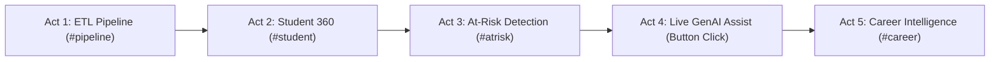

# Campus360 • Demo Day Master Checklist & Presentation Playbook
> **Team Name:** Neural Networks &bull; **Team ID:** 60 &bull; **Problem Code:** KDAC-3  
> **Authors:** Om Patel & Rahil Nagariya &bull; **Repository State:** Frozen & Validated (`submission-final`)

---

## 1. Pre-Presentation Launch Commands

Run this single command sequence in the terminal 5 minutes before presentation to ensure a clean, warmed-up container stack:

```bash
# 1. Bring up the verified production stack in background
docker compose up --build -d

# 2. Wait for the PostgreSQL warehouse (180,000 star-schema rows) and API to report healthy (returns HTTP 200 in ~8-12 seconds)
until curl -s http://localhost:8000/health | grep -q '"status":"healthy"'; do
  echo "Waiting for warehouse ingestion and API healthcheck..."
  sleep 2
done
echo ">>> Campus360 Stack Healthy & Ready for Presentation!"
```

To quickly verify all 38 automated test cases prior to stepping on stage:
```bash
docker compose exec api python -m unittest discover -s tests
# Expected result: Ran 38 tests in ~5-7s -> OK (0 failures, 0 errors)
```

---

## 2. Browser Tabs to Have Pre-Loaded

Open each of these URLs in separate browser tabs (Chrome or Chromium recommended, zoom 100%):

| Tab | URL | Purpose in Presentation |
| :---: | :--- | :--- |
| **Tab 1** | `http://localhost:8501/index.html#pipeline` | **Act 1: Data Lineage & Pipeline Reliability** — Live Postgres status, ETL stages, row-level verification. |
| **Tab 2** | `http://localhost:8501/index.html#student` | **Act 2: Student 360° Profile** — Multi-dimensional radar, 105k assessment records, on-demand AI assistant. |
| **Tab 3** | `http://localhost:8501/index.html#atrisk` | **Act 3: Early-Warning Screening** — Amber calibration banner, top lifestyle drivers, searchable roster. |
| **Tab 4** | `http://localhost:8501/index.html#career` | **Act 4: Career Readiness & Placement** — Percentile benchmarks, readiness gauge, placement trajectory. |
| **Tab 5** | `http://localhost:8501/assess.html` | **Act 5: Bring Your Own Data (BYOD)** — Multi-modal assessment (CSV fuzzy match, CSV stitch, chat, form). |
| **Tab 6** | `http://localhost:8000/arch.html` | **Backup / Q&A Reference** — 12-slide interactive system architecture & data lineage reference deck. |

---

## 3. 5-Act Live Demonstration Script

Follow this structured order from the Campus360 Presentation Guide:



### Act 1: Data Lineage & Pipeline Heartbeat (`#pipeline`) — *30 Seconds*
1. **Show:** Live warehouse ingestion ticker and PostgreSQL healthcheck indicator (`180,000` dimensional rows).
2. **Key Talking Point:** *"Every insight is grounded in an authentic Kimball star schema (`dim_student`, `fact_performance`, `fact_lifestyle`, `fact_career`) loaded via reproducible automated ingestion with zero manual tampering."*

### Act 2: Student 360° Lookup (`#student`) — *45 Seconds*
1. **Action:** Select preset student **`STU00001`** (or type any ID).
2. **Show:** 7-assessment breakdown mini-table, lifestyle habits metrics, and the **GenAI Assistant Standby** card.
3. **Key Talking Point:** *"Notice the AI assistant does not waste API quota or stall page rendering on load — faculty advisors trigger synthesis on-demand when intervention is needed."*

### Act 3: At-Risk Early-Warning Screening (`#atrisk`) — *45 Seconds*
1. **Show:** Amber model calibration banner (`50.22% Recall`, `33.46% Precision`).
2. **Key Talking Point:** *"We deliberately excluded academic metrics like CGPA or backlogs to prevent circular target leakage. Operating purely on behavioral and wellness signals, our Model 2 catches just over half (50.22%) of genuinely at-risk students, transparently communicating that 2 in 3 flags are false alarms intended for low-stakes mentoring check-ins."*

### Act 4: Live GenAI Synthesis Trigger — *30 Seconds*
1. **Action:** In the At-Risk table row, click the **`[ ✨ AI Assist ]`** button for `STU17988` (or `STU00001`).
2. **Action:** The modal opens in standby mode showing student risk factors. Click **`[ ✨ Assist with GenAI ]`**.
3. **Show:** Natural language mentor brief renders in **~1.0 to 1.5 seconds** powered by live Gemini 3.5 Flash Lite.
4. **Key Talking Point:** *"Notice the prompt strictly binds the LLM to the model's factual outputs and includes inline calibration warnings, preventing generative hallucination."*

### Act 5: Career Intelligence & Placement Roadmap (`#career`) — *30 Seconds*
1. **Show:** Half-gauge career readiness score (`/100`), branch-normalized percentile skill gaps bar chart.
2. **Action:** Click **`[ ✨ Assist with GenAI ]`** on the Placement Roadmap card to generate personalized guidance.

---

## 4. Current Official Model Calibration Figures

If judges interrogate model metrics, state these exact, verified numbers:

| Model | Architecture | Current Verified Metric | Key Defense Statement |
| :--- | :--- | :--- | :--- |
| **Model 1** | `GradientBoostingRegressor`<br>`(n=200, depth=3, lr=0.05, max_features='sqrt')` | **$R^2 = 0.2096$**<br>$\text{RMSE} = 0.7581$<br>$\text{MAE} = 0.6022$<br>*(28 features, 5-fold CV)* | *"CGPA is influenced by unobserved human and institutional factors. An $R^2$ of 0.21 represents honest directional guidance (driven 30% by DSA practice and 22% by study hours), rather than artificial over-fitting."* |
| **Model 2** | Balanced `LogisticRegression`<br>`(C=1.0, penalty='l2', solver='liblinear')` | **$\text{Recall} = 50.22\%$**<br>$\text{Precision} = 33.46\%$<br>$\text{ROC AUC} = 0.5190$ | *"Eliminating academic defining features prevents circular leakage. Model 2 catches just over half of at-risk students (50.22%) from lifestyle habits alone, disclosed to advisors as an exploratory check-in prompt."* |

---

## 5. Live Presentation Golden Rules & Emergency Fallback

> [!IMPORTANT]
> **One-Line Live Presentation Rule:**  
> If Google Gemini API experiences a network timeout or remote quota limit during live evaluation, **do not panic and do not stop presenting**. The Campus360 dual-layer architecture activates a deterministic statistical fallback in **under 5 milliseconds**. It renders identical student facts, top driving factors, and calibrated disclosures seamlessly. Keep presenting without missing a beat!

---

## 6. Footer Verification Checklist

- [x] **Campus360 Brand & Logo:** Rendered on bottom-left of main dashboard and BYOD portal (`assets/logo-icon.svg`).
- [x] **Team Name:** **Neural Networks** (displayed with clean typography).
- [x] **Team ID:** **60** (prominently badged).
- [x] **Team Authors & Problem Code:** **Om Patel & Rahil Nagariya &bull; KDAC-3**.
- [x] **Team Logo:** High-resolution neural crest rendered from `assets/team-logo.png`.
