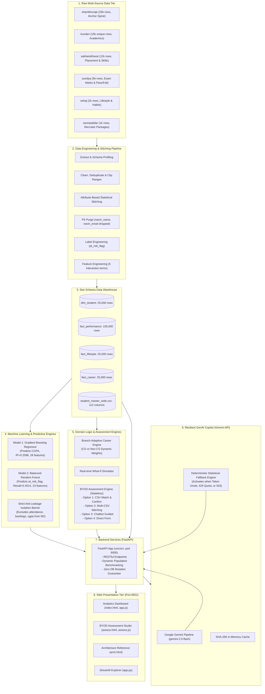
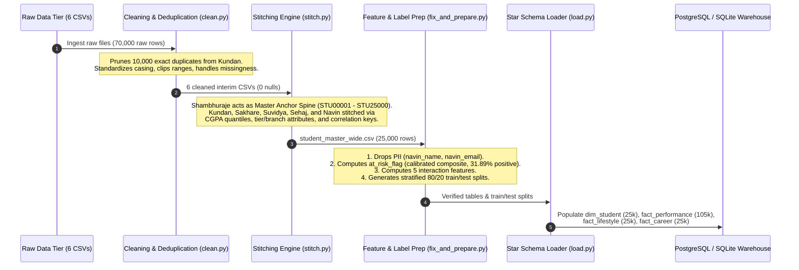
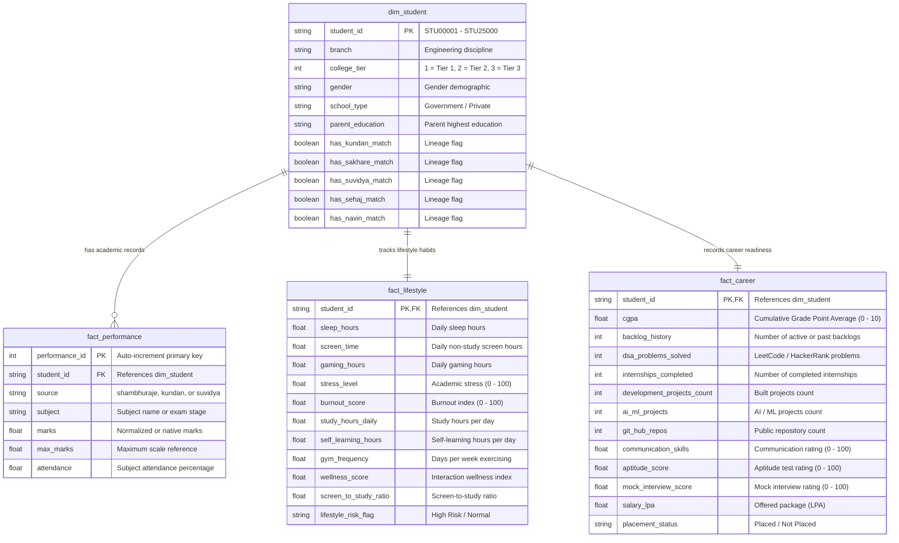
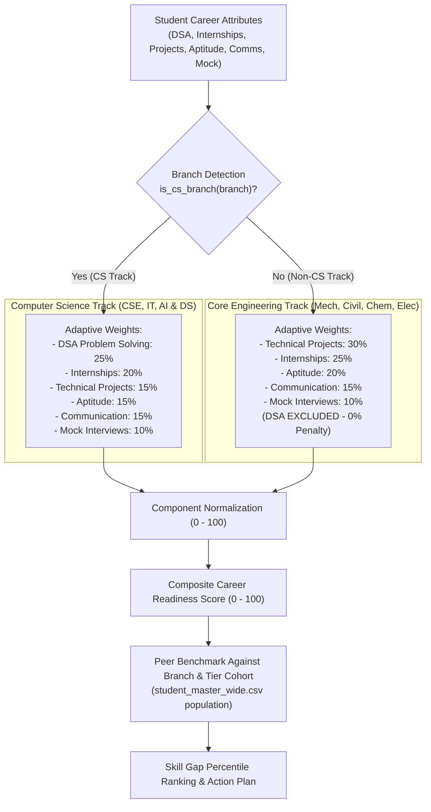
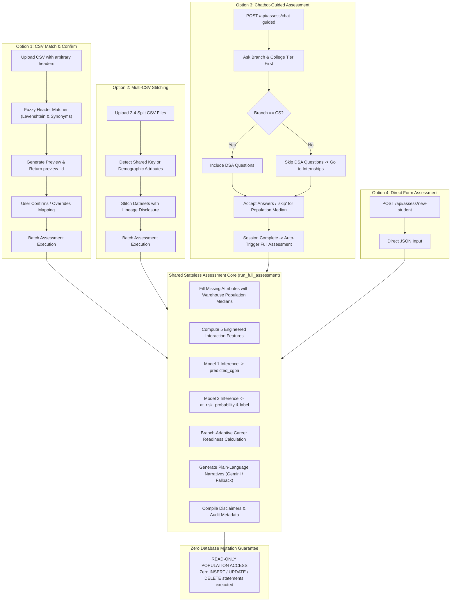
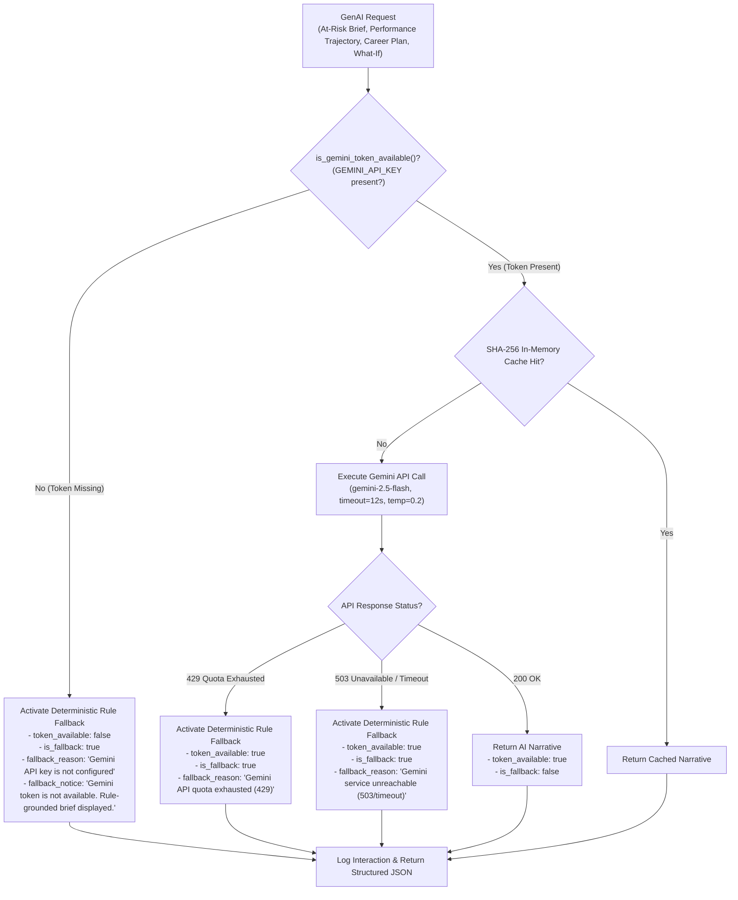
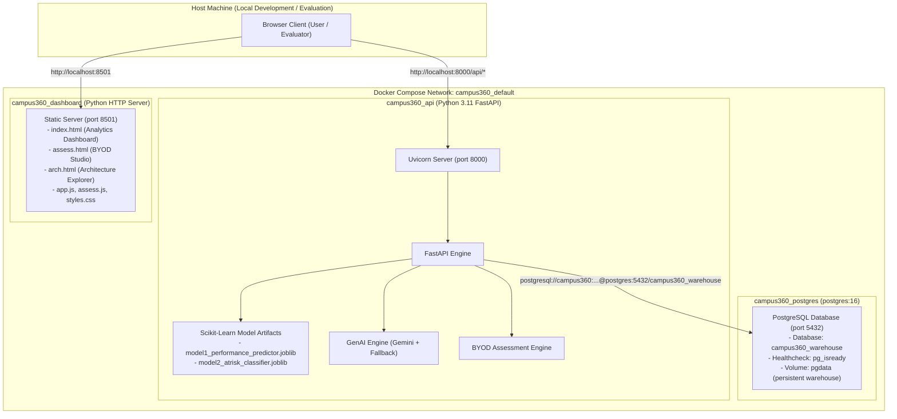

# Campus360: End-to-End System Architecture & Data Flow

**Platform:** Campus360 • Student Academic Success, Risk & Career Intelligence  
**Problem Code:** KDAC-3 (KENEXA AI Hackathon) | **Company:** Kenexai  
**Team Name:** Neural Nexus | **Team ID:** 60  
**Team Members:** OM PATEL [Leader], Rahil Nagariya [Member]  
**Status:** Production-Ready & Containerized  
**Zero Emojis Policy:** Strict text tags and vector SVG visual standards enforced  

---

## 1. Executive Architecture Overview

Campus360 is a decoupled, modular, and containerized higher-education intelligence platform. It reconciles disparate student datasets across academic, lifestyle, coding, and career domains into a unified star-schema data warehouse, executes machine learning inference with strict anti-leakage guarantees, computes discipline-adaptive career readiness, and provides plain-language advisory narratives through a resilient GenAI pipeline.

---

## 2. Data Engineering & Stitching Flow

In higher education, student intelligence is siloed. No universal student identity exists across independent surveys and legacy ERPs. Campus360 stitches 6 independent raw datasets onto an anchor spine using **Attribute-Based Statistical Similarity Matching** while preserving native scales, zero nulls after imputation, and full lineage disclosure.

### Data Lineage & Volume Audit

| Dataset Key | Canonical Raw Filename | Raw Rows | Processed Rows | Match Criteria / Target Dimension | Lineage Flag |
|---|---|---|---|---|---|
| `shambhuraje` | `shambhuraje_placement_career_2026.csv` | 25,000 | 25,000 | **Master Anchor Spine** (`STU00001`–`STU25000`) | Core Spine |
| `kundan` | `kundan_student_performance.csv` | 25,000 | 15,000 | Secondary academics matched on CGPA quantile & branch | `has_kundan_match` |
| `sakharebharat` | `sakharebharat_indian_placement_2025.csv` | 12,000 | 12,000 | Placement & skills matched on engineering branch & tier | `has_sakhare_match` |
| `suvidya` | `suvidya_student_performance.csv` | 5,000 | 5,000 | Intermediate marks matched on CGPA correlation ($r=0.807$) | `has_suvidya_match` |
| `sehaj` | `sehaj_student_lifestyle.csv` | 2,000 | 2,000 | Lifestyle & physical habits matched on scaled GPA | `has_sehaj_match` |
| `navinpatidar` | `navinpatidar_indian_placement.csv` | 1,000 | 1,000 | Top recruiter packages matched on high-tier academic band | `has_navin_match` |

---

## 3. Star Schema Warehouse Entity-Relationship Architecture

The production warehouse resides in **PostgreSQL 16** (`campus360_warehouse`) with automatic local fallback to embedded **SQLite** (`data/processed/warehouse.db`).

---

## 4. Predictive Modeling & Anti-Leakage Architecture

### Target & Label Engineering
- **Model 1 (Academic Trajectory Regressor)**:
  - **Target**: `anchor_cgpa` (Continuous 0.0 – 10.0).
  - **Algorithm**: Gradient Boosting Regressor (28 features).
  - **Calibrated Baseline**: $R^2 = 0.2096$, $\text{RMSE} = 0.7581$, $\text{MAE} = 0.6022$.
  - **Operational Framing**: Captures directional movement from effort and study hours; disclosed as a low-confidence directional signal ($R^2 < 0.30$).
- **Model 2 (At-Risk Early Warning Classifier)**:
  - **Target**: `at_risk_flag` (Binary 0 or 1).
  - **Defining Formula**:
    $$\text{at\_risk\_flag} = 1 \iff (\text{backlogs} \ge 1 \lor \text{attendance} < 55\% \lor \text{CGPA} < 5.5)$$
  - **Class Distribution**: 31.89% At-Risk (7,973 students) vs 68.11% Safe (17,027 students).
  - **Algorithm**: Balanced Random Forest Classifier (23 lifestyle features).
  - **Calibrated Baseline**: Recall = 0.4514, Precision = 0.3230, Accuracy = 0.5232 at 0.50 decision threshold.

### Strict Anti-Leakage Isolation Barrier

```mermaid
flowchart LR
    subgraph DefiningFormula["Target Definition (at_risk_flag)"]
        F1["anchor_backlog_history (>= 1)"]
        F2["anchor_attendance_percentage (< 55%)"]
        F3["anchor_cgpa (< 5.5)"]
    end

    subgraph LeakageWall["Strict Isolation Barrier"]
        BLOCKED["BLOCKED FROM MODEL 2 INPUTS\n- No Backlogs\n- No Attendance\n- No CGPA"]
    end

    subgraph Model2Features["Model 2 Safe Features (23 Lifestyle Attributes)"]
        L1["anchor_sleep_hours"]
        L2["anchor_screen_time"]
        L3["anchor_gaming_hours"]
        L4["anchor_stress_level"]
        L5["anchor_burnout_score"]
        L6["anchor_study_hours_daily"]
        L7["anchor_self_learning_hours"]
        L8["anchor_motivation_level"]
        L9["anchor_adaptability_score"]
        L10["anchor_gym_frequency"]
        L11["anchor_family_income_lpa"]
        L12["anchor_resume_score"]
        L13["anchor_communication_skills"]
        L14["anchor_aptitude_score"]
        L15["anchor_mock_interview_score"]
        L16["wellness_score"]
        L17["screen_to_study_ratio"]
        L18["projects & hackathons"]
    end

    subgraph Model2Output["Model 2 Inference"]
        M2["Balanced Random Forest Classifier\nThreshold = 0.50"]
        PRED["predicted_risk_probability\nis_predicted_at_risk"]
    end

    DefiningFormula -.-> BLOCKED
    BLOCKED -.-x Model2Features
    Model2Features --> M2
    M2 --> PRED
```

---

## 5. Branch-Adaptive Career Readiness Engine

The Career Readiness engine evaluates students on a 0 – 100 composite scale and performs peer comparisons against cohorts in the same branch and college tier. To prevent unfair bias, weighting dynamically adapts based on whether the student belongs to a Computer Science/Tech track or a Core Engineering track.

---

## 6. Stateless "Bring Your Own Data" (BYOD) Ingestion Flows

The `/api/assess/*` endpoints allow faculty, recruiters, and students to evaluate external student profiles without inserting, updating, or mutating a single row in the production data warehouse.

---

## 7. GenAI Copilot & Resilient Token Fallback Architecture

Campus360 integrates Google Gemini (`gemini-2.5-flash`) for automated advisory generation. To ensure zero system crashes during live hackathon demonstrations or network outages, it implements an instant, deterministic statistical fallback pipeline.

---

## 8. Runtime Service Topology & Docker Architecture

All platform services are containerized via Docker and Docker Compose.

### Container Port & Volume Specifications

| Container Name | Base Image | Exposed Port | Purpose | Mounted Volumes |
|---|---|---|---|---|
| `campus360_postgres` | `postgres:16` | `5432:5432` | Star Schema Data Warehouse | `pgdata:/var/lib/postgresql/data` |
| `campus360_api` | `campus360-api` (Python 3.11-slim) | `8000:8000` | REST API, ML Inference, BYOD & GenAI | `./src:/app/src`, `./data:/app/data`, `./models:/app/models`, `./tests:/app/tests` |
| `campus360_dashboard` | `campus360-dashboard` (Python 3.11-slim) | `8501:8501` | Static Web Frontends | `./src/dashboard:/usr/share/campus360/dashboard` |

---

## 9. End-to-End Request & Data Lifecycle

To trace how a request flows through the entire system, consider a user submitting a direct assessment form for a **Mechanical Engineering student**:

1. **User Action**: The user selects `Mechanical` branch, enters attendance (82%), daily study hours (4.5), and internships (2) on `http://localhost:8501/assess.html`. The UI dynamically detects the non-CS branch and informs the user that DSA problem solving is omitted from scoring.
2. **HTTP Dispatch**: `assess.js` sends an HTTP POST request to `http://localhost:8000/api/assess/new-student`.
3. **Imputation**: `run_full_assessment()` intercepts the payload. Missing attributes (sleep hours, stress level, aptitude) are imputed with population medians from `student_master_wide.csv`.
4. **Feature Engineering**: Calculates `effort_score`, `screen_to_study_ratio`, and `wellness_score`. Non-CS students compute effort without DSA penalties.
5. **Model 1 Prediction**: The 28-feature vector is passed to `models/model1_performance_predictor.joblib`, predicting a CGPA of `7.32`.
6. **Model 2 Prediction**: The 23 lifestyle features (strictly excluding CGPA, backlogs, and attendance) are passed to `models/model2_atrisk_classifier.joblib`, returning an at-risk probability of `0.58` (`At-Risk`).
7. **Career Scoring**: `_compute_career_readiness()` detects `is_cs_branch("Mechanical") == False`, applies non-CS weights (Projects 30%, Internships 25%, Aptitude 20%, Communication 15%, Mock Interview 10%), benchmarks the student against Mechanical peers in Tier 2, and returns a Career Readiness Score of `49.3/100`.
8. **GenAI Narrative**: `generate_atrisk_brief()` calls Gemini. If `GEMINI_API_KEY` is not present or quota is exhausted (429), it returns the deterministic rule-grounded brief with `token_available` and `fallback_notice` metadata.
9. **Zero DB Mutation Verification**: No records are inserted into `dim_student`, `fact_performance`, `fact_lifestyle`, or `fact_career`.
10. **Response Rendering**: The frontend renders the predicted CGPA, risk badge, career breakdown, peer comparison, and AI mentor brief with crisp SVG icons and zero emojis.
