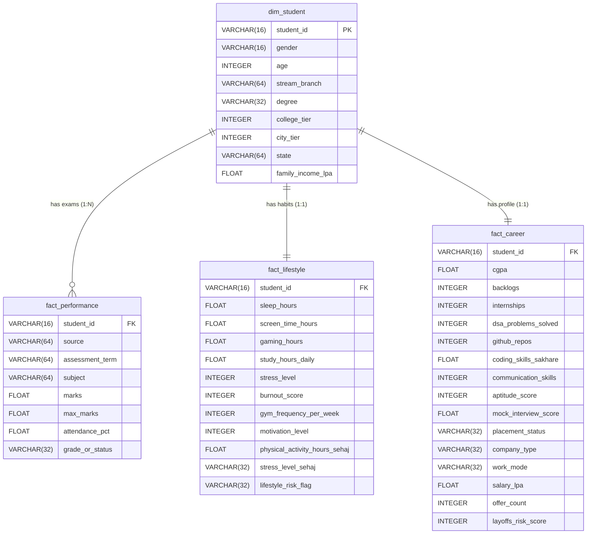
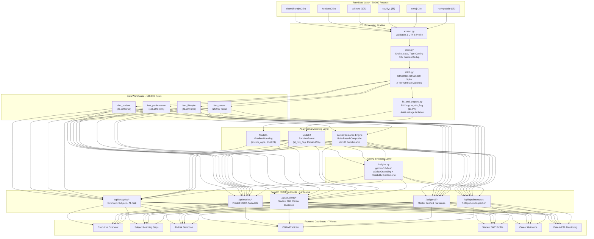

# Campus360: Comprehensive Technical Reference Manual & Deep Dive
**Author / Engineering Team:** Om Patel & Rahil Nagariya (Team ID: 60)  
**Hackathon:** KENEXA AI Hackathon (Problem Code: KDAC-3)  
**Document Purpose:** Single authoritative technical reference manual covering complete column-level data lineage, database architecture, live re-scored model specifications, and end-to-end system connections for live evaluation and technical defense.  
**Verification Guarantee:** Every metric, parameter, table count, and hyperparameter in this document was extracted via live programmatic queries executed against the active repository artifacts, serialized models, and database engine.

---

## Table of Contents
1. [Section 1: Column-Level Data Lineage & Feature Engineering](#section-1-column-level-data-lineage--feature-engineering)
   - [1.1 Dataset 1: Shambhuraje Placement & Career 2026 (Anchor Spine)](#11-dataset-1-shambhuraje-placement--career-2026-master-anchor)
   - [1.2 Dataset 2: Kundan Student Performance](#12-dataset-2-kundan-student-performance)
   - [1.3 Dataset 3: Sakhare Bharat Indian Placement 2025](#13-dataset-3-sakhare-bharat-indian-placement-2025)
   - [1.4 Dataset 4: Suvidya Student Performance](#14-dataset-4-suvidya-student-performance)
   - [1.5 Dataset 5: Sehaj Student Lifestyle](#15-dataset-5-sehaj-student-lifestyle)
   - [1.6 Dataset 6: Navin Patidar Indian Placement](#16-dataset-6-navin-patidar-indian-placement)
   - [1.7 Engineered Features & Formulation Lineage](#17-engineered-features--formulation-lineage)
2. [Section 2: Database Architecture & Star Schema](#section-2-database-architecture--star-schema)
   - [2.1 Physical Storage Engine Status](#21-physical-storage-engine-status)
   - [2.2 Entity Relationship Diagram (ERD)](#22-entity-relationship-diagram-erd)
   - [2.3 Table Specification: `dim_student`](#23-dimension-table-dim_student)
   - [2.4 Table Specification: `fact_performance`](#24-fact-table-fact_performance)
   - [2.5 Table Specification: `fact_lifestyle`](#25-fact-table-fact_lifestyle)
   - [2.6 Table Specification: `fact_career`](#26-fact-table-fact_career)
3. [Section 3: Machine Learning & Analytics Engine Specifications](#section-3-machine-learning--analytics-engine-specifications)
   - [3.1 Model 1: Academic Performance Predictor (Regression)](#31-model-1-academic-performance-predictor-regression)
   - [3.2 Model 2: At-Risk Student Early-Warning Classifier (Classification)](#32-model-2-at-risk-student-early-warning-classifier-classification)
   - [3.3 Engine 3: Career Readiness & Skill Gap Engine (Rule-Based Composite)](#33-engine-3-career-readiness--skill-gap-engine-rule-based-composite)
4. [Section 4: System Connections, API Layer & Data Flow](#section-4-system-connections-api-layer--data-flow)
   - [4.1 End-to-End Architectural Data Flow](#41-end-to-end-architectural-data-flow)
   - [4.2 Dashboard View to API Endpoint Mapping](#42-dashboard-view-to-api-endpoint-mapping)
   - [4.3 API Endpoint to Database & Artifact Dependency Mapping](#43-api-endpoint-to-database--artifact-dependency-mapping)
   - [4.4 GenAI Synthesis Layer & Prompt Architecture](#44-genai-synthesis-layer--prompt-architecture)
5. [Section 5: One-Page Executive Summary Table](#section-5-one-page-executive-summary-table)

---

# Section 1: Column-Level Data Lineage & Feature Engineering

The Campus360 data platform synthesizes **6 independent raw datasets** totaling **70,000 raw records** into a single master cohort of **25,000 university students** (`STU00001` through `STU25000`).

The tables below trace every single raw column across all 6 datasets through `src/etl/clean.py`, `src/etl/stitch.py`, and `src/etl/fix_and_prepare.py` into `student_master_wide.csv` and the downstream star schema tables (`dim_student`, `fact_performance`, `fact_lifestyle`, `fact_career`).

```
Raw CSVs (70,000 rows across 6 files)
   │
   ▼  [clean.py: snake_case, type casting, range clipping, Kundan deduplication]
Interim Clean CSVs (60,000 clean records in data/interim/)
   │
   ▼  [stitch.py: Anchor assignment (STU00001-STU25000) & 2-tier attribute matching]
Wide Integration (student_master_wide.csv: 25,000 rows x 116 cols)
   │
   ├─► [fix_and_prepare.py: PII drop, categorical normalization, 5 engineered features, ML splits]
   │
   └─► [load.py: Normalization & Long-Format Melting]
       ├── dim_student (25,000 rows)
       ├── fact_performance (105,000 rows)
       ├── fact_lifestyle (25,000 rows)
       └── fact_career (25,000 rows)
```

---

### 1.1 Dataset 1: Shambhuraje Placement & Career 2026 (Master Anchor)
- **Source File:** `data/raw/shambhuraje_placement_career_2026.csv`
- **Role:** Golden Record Anchor Spine (100% population coverage). Establishes student identities `STU00001` to `STU25000`.
- **Raw Volume:** 25,000 rows, 44 columns | **Clean Volume:** 25,000 rows, 44 columns

| # | Raw Column Name | Renamed To (`student_master_wide.csv`) | Raw Type | Example Value | Used In (Warehouse / Feature Layer) |
|---|---|---|---|---|---|
| 1 | `student_id` | `student_id` (Overwritten with `STU00001`–`STU25000`) | `str` | `'STU00001'` | Primary Key in `dim_student`; Foreign Key in all 3 fact tables |
| 2 | `age` | `anchor_age` | `int64` | `22` | `dim_student.age` |
| 3 | `gender` | `anchor_gender` | `str` | `'Male'` | `dim_student.gender` |
| 4 | `state` | `anchor_state` | `str` | `'Karnataka'` | `dim_student.state` |
| 5 | `city_tier` | `anchor_city_tier` | `int64` | `1` | `dim_student.city_tier` |
| 6 | `college_tier` | `anchor_college_tier` | `int64` | `2` | `dim_student.college_tier` |
| 7 | `branch` | `anchor_branch` | `str` | `'Computer Science'` | `dim_student.stream_branch` |
| 8 | `degree` | `anchor_degree` | `str` | `'MCA'` | `dim_student.degree` |
| 9 | `cgpa` | `anchor_cgpa` | `float64` | `6.71` | `fact_career.cgpa`, `fact_performance.marks` (Degree CGPA), Model 1 Target |
| 10 | `backlog_history` | `anchor_backlog_history` | `int64` | `3` | `fact_career.backlogs`, Target constituent for `at_risk_flag` |
| 11 | `attendance_percentage` | `anchor_attendance_percentage` | `float64` | `75.5` | `fact_performance.attendance_pct`, Model 1 feature |
| 12 | `primary_language` | `anchor_primary_language` | `str` | `'C++'` | Retained in wide table (Student profile) |
| 13 | `DSA_problems_solved` | `anchor_dsa_problems_solved` | `int64` | `656` | `fact_career.dsa_problems_solved`, Career Engine (25% weight), Model 1 |
| 14 | `GitHub_repos` | `anchor_git_hub_repos` | `float64` | `10.0` | `fact_career.github_repos`, Model 1 & Model 2 feature |
| 15 | `hackathons_participated` | `anchor_hackathons_participated` | `int64` | `2` | Engineered into `project_activity`, Model 1 & 2 feature |
| 16 | `development_projects_count` | `anchor_development_projects_count` | `int64` | `5` | Engineered into `project_activity`, Career Engine (`_projects_total`) |
| 17 | `AI_ML_projects` | `anchor_ai_ml_projects` | `int64` | `0` | Engineered into `project_activity`, Career Engine (`_projects_total`) |
| 18 | `internships_completed` | `anchor_internships_completed` | `int64` | `1` | `fact_career.internships`, Career Engine (20% weight), Model 1 |
| 19 | `resume_score` | `anchor_resume_score` | `int64` | `55` | Retained in wide table; Model 1 & Model 2 feature |
| 20 | `communication_skills` | `anchor_communication_skills` | `int64` | `97` | `fact_career.communication_skills`, Career Engine (15% weight), Model 1 & 2 |
| 21 | `aptitude_score` | `anchor_aptitude_score` | `int64` | `100` | `fact_career.aptitude_score`, Career Engine (15% weight), Model 1 & 2 |
| 22 | `mock_interview_score` | `anchor_mock_interview_score` | `float64` | `80.0` | `fact_career.mock_interview_score`, Career Engine (10% weight), Model 1 & 2 |
| 23 | `sleep_hours` | `anchor_sleep_hours` | `float64` | `5.7` | `fact_lifestyle.sleep_hours`, Model 1 & 2 feature |
| 24 | `screen_time` | `anchor_screen_time` | `float64` | `7.7` | `fact_lifestyle.screen_time_hours`, Model 1 & 2 feature |
| 25 | `gaming_hours` | `anchor_gaming_hours` | `float64` | `1.5` | `fact_lifestyle.gaming_hours`, Model 1 & 2 feature |
| 26 | `study_hours_daily` | `anchor_study_hours_daily` | `float64` | `8.0` | `fact_lifestyle.study_hours_daily`, Model 1 & 2 feature |
| 27 | `stress_level` | `anchor_stress_level` | `int64` | `71` | `fact_lifestyle.stress_level`, Model 1 & 2 feature |
| 28 | `burnout_score` | `anchor_burnout_score` | `int64` | `34` | `fact_lifestyle.burnout_score`, Model 1 & 2 feature |
| 29 | `gym_frequency` | `anchor_gym_frequency` | `int64` | `0` | `fact_lifestyle.gym_frequency_per_week`, Model 2 feature |
| 30 | `family_income_lpa` | `anchor_family_income_lpa` | `float64` | `5.0` | `dim_student.family_income_lpa`, Model 1 & 2 feature |
| 31 | `self_learning_hours` | `anchor_self_learning_hours` | `float64` | `2.7` | Engineered into `effort_score`, Model 1 & 2 feature |
| 32 | `motivation_level` | `anchor_motivation_level` | `int64` | `60` | `fact_lifestyle.motivation_level`, Model 1 & 2 feature |
| 33 | `placement_status` | `anchor_placement_status` | `str` | `'Placed'` | `fact_career.placement_status` |
| 34 | `company_type` | `anchor_company_type` | `str` | `'Startup'` | `fact_career.company_type` |
| 35 | `work_mode` | `anchor_work_mode` | `str` | `'Remote'` | `fact_career.work_mode` |
| 36 | `salary_lpa` | `anchor_salary_lpa` | `float64` | `17.36` | `fact_career.salary_lpa` |
| 37 | `interview_rounds_cleared` | `anchor_interview_rounds_cleared` | `int64` | `4` | Retained in wide table (Recruitment history) |
| 38 | `offer_count` | `anchor_offer_count` | `int64` | `1` | `fact_career.offer_count` |
| 39 | `joining_delay_months` | `anchor_joining_delay_months` | `int64` | `2` | Retained in wide table (Corporate transition) |
| 40 | `layoffs_risk_score` | `anchor_layoffs_risk_score` | `int64` | `62` | `fact_career.layoffs_risk_score` |
| 41 | `AI_tool_usage_frequency` | `anchor_ai_tool_usage_frequency` | `int64` | `55` | Retained in wide table; Model 1 & 2 feature |
| 42 | `prompt_engineering_skill` | `anchor_prompt_engineering_skill` | `int64` | `55` | Retained in wide table; Model 1 & 2 feature |
| 43 | `AI_fear_score` | `anchor_ai_fear_score` | `int64` | `19` | Retained in wide table (Tech sentiment) |
| 44 | `adaptability_score` | `anchor_adaptability_score` | `int64` | `81` | Retained in wide table; Model 1 & 2 feature |

---

### 1.2 Dataset 2: Kundan Student Performance
- **Source File:** `data/raw/kundan_student_performance.csv`
- **Role:** Secondary school subject marks, attendance, and study methodology.
- **Raw Volume:** 25,000 rows, 16 columns | **Clean Volume:** 15,000 rows (10,000 exact duplicates removed in `clean.py`)
- **Matched Coverage in Warehouse:** 15,000 students (`has_kundan_match = 1`, 60.0% coverage).

| # | Raw Column Name | Renamed To (`student_master_wide.csv`) | Raw Type | Example Value | Used In (Warehouse / Feature Layer) |
|---|---|---|---|---|---|
| 1 | `student_id` | Dropped in `stitch.py` (Replaced by `student_id`) | `int64` | `1` | Source internal index (discarded) |
| 2 | `age` | `kundan_age` | `int64` | `14` | Retained in wide table |
| 3 | `gender` | `kundan_gender` | `str` | `'male'` | Demographic matching key in `stitch.py` |
| 4 | `school_type` | `kundan_school_type` | `str` | `'public'` | Capitalized to Title Case in `fix_and_prepare.py` |
| 5 | `parent_education` | `kundan_parent_education` | `str` | `'post graduate'` | Capitalized to Title Case in `fix_and_prepare.py` |
| 6 | `study_hours` | `kundan_study_hours` | `float64` | `3.1` | Retained in wide table |
| 7 | `attendance_percentage` | `kundan_attendance_percentage` | `float64` | `84.3` | `fact_performance.attendance_pct` (Kundan subject rows) |
| 8 | `internet_access` | `kundan_internet_access` | `str` | `'yes'` | Capitalized in `fix_and_prepare.py` |
| 9 | `travel_time` | `kundan_travel_time` | `str` | `'<15 min'` | Capitalized in `fix_and_prepare.py` |
| 10 | `extra_activities` | `kundan_extra_activities` | `str` | `'yes'` | Capitalized in `fix_and_prepare.py` |
| 11 | `study_method` | `kundan_study_method` | `str` | `'notes'` | Capitalized in `fix_and_prepare.py` |
| 12 | `math_score` | `kundan_math_score` | `float64` | `42.7` | `fact_performance.marks` (Subject: `'Mathematics'`, Source: `'Kundan'`) |
| 13 | `science_score` | `kundan_science_score` | `float64` | `55.4` | `fact_performance.marks` (Subject: `'Science'`, Source: `'Kundan'`) |
| 14 | `english_score` | `kundan_english_score` | `float64` | `57.0` | `fact_performance.marks` (Subject: `'English'`, Source: `'Kundan'`) |
| 15 | `overall_score` | `kundan_overall_score` | `float64` | `53.1` | `fact_performance.marks` (Subject: `'Overall Score'`, Source: `'Kundan'`), Performance matching key in `stitch.py` |
| 16 | `final_grade` | `kundan_final_grade` | `str` | `'e'` | `fact_performance.grade_or_status` (Normalized to uppercase `'E'` in `fix_and_prepare.py`) |

---

### 1.3 Dataset 3: Sakhare Bharat Indian Placement 2025
- **Source File:** `data/raw/sakharebharat_indian_placement_2025.csv`
- **Role:** Technical skills assessment, engineering placement status, and salary packages.
- **Raw Volume:** 12,000 rows, 16 columns | **Clean Volume:** 12,000 rows
- **Matched Coverage in Warehouse:** 12,000 students (`has_sakhare_match = 1`, 48.0% coverage).

| # | Raw Column Name | Renamed To (`student_master_wide.csv`) | Raw Type | Example Value | Used In (Warehouse / Feature Layer) |
|---|---|---|---|---|---|
| 1 | `student_id` | Dropped in `stitch.py` (Replaced by `student_id`) | `int64` | `1` | Source internal index (discarded) |
| 2 | `gender` | `sakhare_gender` | `str` | `'Male'` | Demographic matching key in `stitch.py` |
| 3 | `age` | `sakhare_age` | `int64` | `20` | Retained in wide table |
| 4 | `degree` | `sakhare_degree` | `str` | `'BE'` | Retained in wide table |
| 5 | `branch` | `sakhare_branch` | `str` | `'Mechanical'` | Clustered to `branch_cluster` in `stitch.py` |
| 6 | `cgpa` | `sakhare_cgpa` | `float64` | `8.4` | Performance tertile matching key in `stitch.py` |
| 7 | `backlogs` | `sakhare_backlogs` | `int64` | `2` | Retained in wide table |
| 8 | `internships` | `sakhare_internships` | `int64` | `2` | Retained in wide table |
| 9 | `certifications` | `sakhare_certifications` | `int64` | `2` | Retained in wide table |
| 10 | `coding_skills` | `sakhare_coding_skills` | `int64` | `1` | `fact_career.coding_skills_sakhare` (scale 1–10) |
| 11 | `communication_skills` | `sakhare_communication_skills` | `int64` | `3` | Retained in wide table (validation check against anchor) |
| 12 | `aptitude_score` | `sakhare_aptitude_score` | `int64` | `69` | Retained in wide table |
| 13 | `projects` | `sakhare_projects` | `int64` | `0` | Retained in wide table |
| 14 | `placed` | `sakhare_placed` | `int64` | `0` | Cleaned: placed=0 sets `company_type = 'Not Placed'` |
| 15 | `company_type` | `sakhare_company_type` | `str` | `'Service'` | Imputed with mode for placed, 'Not Placed' for unplaced |
| 16 | `package_lpa` | `sakhare_package_lpa` | `float64` | `0.0` | Retained in wide table |

---

### 1.4 Dataset 4: Suvidya Student Performance
- **Source File:** `data/raw/suvidya_student_performance.csv`
- **Role:** Intermediate/higher secondary school academic examination performance.
- **Raw Volume:** 5,000 rows, 16 columns | **Clean Volume:** 5,000 rows
- **Matched Coverage in Warehouse:** 5,000 students (`has_suvidya_match = 1`, 20.0% coverage).

| # | Raw Column Name | Renamed To (`student_master_wide.csv`) | Raw Type | Example Value | Used In (Warehouse / Feature Layer) |
|---|---|---|---|---|---|
| 1 | `Student_ID` | Dropped in `stitch.py` (Replaced by `student_id`) | `str` | `'S0001'` | Source identifier (discarded) |
| 2 | `Age` | `suvidya_age` | `int64` | `15` | Retained in wide table |
| 3 | `Gender` | `suvidya_gender` | `str` | `'Male'` | Demographic matching key in `stitch.py` |
| 4 | `Class` | `suvidya_academic_class` | `int64` | `12` | Renamed in `clean.py` to prevent SQL keyword conflict |
| 5 | `Study_Hours_Per_Day` | `suvidya_study_hours_per_day` | `float64` | `1.0` | Retained in wide table |
| 6 | `Attendance_Percentage` | `suvidya_attendance_percentage` | `int64` | `65` | `fact_performance.attendance_pct` (Suvidya subject rows) |
| 7 | `Parental_Education` | `suvidya_parental_education` | `str` | `'Postgraduate'` | Retained in wide table |
| 8 | `Internet_Access` | `suvidya_internet_access` | `str` | `'No'` | Retained in wide table |
| 9 | `Extracurricular_Activities` | `suvidya_extracurricular_activities` | `str` | `'No'` | Retained in wide table |
| 10 | `Math_Score` | `suvidya_math_score` | `int64` | `40` | `fact_performance.marks` (Subject: `'Mathematics'`, Source: `'Suvidya'`) |
| 11 | `Science_Score` | `suvidya_science_score` | `int64` | `39` | `fact_performance.marks` (Subject: `'Science'`, Source: `'Suvidya'`) |
| 12 | `English_Score` | `suvidya_english_score` | `int64` | `72` | `fact_performance.marks` (Subject: `'English'`, Source: `'Suvidya'`) |
| 13 | `Previous_Year_Score` | `suvidya_previous_year_score` | `int64` | `81` | Retained in wide table |
| 14 | `Final_Percentage` | `suvidya_final_percentage` | `float64` | `50.33` | `fact_performance.marks` (Subject: `'Overall Percentage'`, Source: `'Suvidya'`), Matching key |
| 15 | `Performance_Level` | `suvidya_performance_level` | `str` | `'Average'` | `fact_performance.grade_or_status` for Overall Percentage row |
| 16 | `Pass_Fail` | `suvidya_pass_fail` | `str` | `'Pass'` | `fact_performance.grade_or_status` for Math, Science, English rows |

---

### 1.5 Dataset 5: Sehaj Student Lifestyle
- **Source File:** `data/raw/sehaj_student_lifestyle.csv`
- **Role:** Deep lifestyle survey covering physical activity, extracurriculars, sleep, and social habits.
- **Raw Volume:** 2,000 rows, 8 columns | **Clean Volume:** 2,000 rows
- **Matched Coverage in Warehouse:** 2,000 students (`has_sehaj_match = 1`, 8.0% coverage).

| # | Raw Column Name | Renamed To (`student_master_wide.csv`) | Raw Type | Example Value | Used In (Warehouse / Feature Layer) |
|---|---|---|---|---|---|
| 1 | `Student_ID` | Dropped in `stitch.py` (Replaced by `student_id`) | `int64` | `1` | Source row index (discarded) |
| 2 | `Study_Hours_Per_Day` | `sehaj_study_hours_per_day` | `float64` | `6.9` | Retained in wide table |
| 3 | `Extracurricular_Hours_Per_Day` | `sehaj_extracurricular_hours_per_day` | `float64` | `3.8` | Retained in wide table |
| 4 | `Sleep_Hours_Per_Day` | `sehaj_sleep_hours_per_day` | `float64` | `8.7` | Retained in wide table |
| 5 | `Social_Hours_Per_Day` | `sehaj_social_hours_per_day` | `float64` | `2.8` | Retained in wide table |
| 6 | `Physical_Activity_Hours_Per_Day` | `sehaj_physical_activity_hours_per_day` | `float64` | `1.8` | `fact_lifestyle.physical_activity_hours_sehaj` |
| 7 | `GPA` | `sehaj_gpa` | `float64` | `2.99` | Performance tertile matching key in `stitch.py` (4.0 scale) |
| 8 | `Stress_Level` | `sehaj_stress_level` | `str` | `'Moderate'` | `fact_lifestyle.stress_level_sehaj` |

---

### 1.6 Dataset 6: Navin Patidar Indian Placement
- **Source File:** `data/raw/navinpatidar_indian_placement.csv`
- **Role:** Real-world verified corporate placement packages and company roles.
- **Raw Volume:** 1,000 rows, 10 columns | **Clean Volume:** 1,000 rows
- **Matched Coverage in Warehouse:** 1,000 students (`has_navin_match = 1`, 4.0% coverage).

| # | Raw Column Name | Renamed To (`student_master_wide.csv`) | Raw Type | Example Value | Used In (Warehouse / Feature Layer) |
|---|---|---|---|---|---|
| 1 | `Name` | **DROPPED IN STEP 1** (`navin_name`) | `str` | `'Yasmin Yadav'` | **PII Drop:** Stripped in `fix_and_prepare.py` to ensure zero student PII |
| 2 | `Email` | **DROPPED IN STEP 1** (`navin_email`) | `str` | `'ibrar@gmail.com'` | **PII Drop:** Stripped in `fix_and_prepare.py` to ensure zero student PII |
| 3 | `Course` | `navin_course` | `str` | `'B.Sc'` | Retained in wide table |
| 4 | `Branch` | `navin_branch` | `str` | `'Civil'` | Clustered to `branch_cluster` in `stitch.py` |
| 5 | `Graduation Year` | `navin_graduation_year` | `int64` | `2020` | Retained in wide table |
| 6 | `Company` | `navin_company` | `str` | `'Google'` | Retained in wide table |
| 7 | `Job Role` | `navin_job_role` | `str` | `'Web Developer'` | Retained in wide table |
| 8 | `Salary (INR)` | `navin_salary_inr` | `int64` | `808813` | Performance matching key in `stitch.py` |
| 9 | `Location` | `navin_location` | `str` | `'Delhi'` | Retained in wide table |
| 10 | `Placement Date` | `navin_placement_date` | `str` | `'2024-08-14'` | Retained in wide table |
| * | *Engineered in clean.py* | `navin_salary_lpa` | `float64` | `8.09` | Computed as `round(salary_inr / 100000.0, 2)` |
| * | *Engineered in clean.py* | `navin_placement_status` | `str` | `'Placed'` | 100% placed cohort flag |

---

### 1.7 Engineered Features & Formulation Lineage
The platform engineers 5 interaction and risk metrics directly in `src/etl/fix_and_prepare.py` (and 1 risk flag in `src/etl/load.py`).

> [!IMPORTANT]
> The exact programmatic definitions below are pulled directly from `src/etl/fix_and_prepare.py` lines 196–265.

#### 1. `effort_score`
- **Programmatic Formula:**
  ```python
  df["effort_score"] = df["anchor_study_hours_daily"] + df["anchor_self_learning_hours"]
  ```
- **Rationale:** Captures total daily academic commitment across scheduled curriculum study and autonomous self-learning. Used in Model 1.

#### 2. `screen_to_study_ratio`
- **Programmatic Formula:**
  ```python
  df["screen_to_study_ratio"] = df["anchor_screen_time"] / (df["anchor_study_hours_daily"] + 1)
  ```
- **Rationale:** Measures digital lifestyle distraction relative to academic dedication. The `+ 1` constant prevents division-by-zero errors. Top importance feature in Model 2.

#### 3. `wellness_score`
- **Programmatic Formula:**
  ```python
  df["wellness_score"] = (
      df["anchor_sleep_hours"]
      - (df["anchor_stress_level"] / 10.0)
      - (df["anchor_burnout_score"] / 10.0)
  )
  ```
- **Rationale:** Balances physiological restorative time (sleep) against psychological distress factors (stress and burnout scaled to a 0–10 basis). Used in Models 1 & 2.

#### 4. `project_activity`
- **Programmatic Formula:**
  ```python
  df["project_activity"] = (
      df["anchor_development_projects_count"]
      + df["anchor_ai_ml_projects"]
      + df["anchor_hackathons_participated"]
  )
  ```
- **Rationale:** Evaluates applied practical software development and collaborative hackathon engagement beyond classroom coursework. Used in Model 1.

#### 5. `at_risk_flag` (Target for Model 2)
- **Exact Programmatic Definition (`src/etl/fix_and_prepare.py:196-201`):**
  ```python
  tuned_cond = (
      (df["anchor_backlog_history"] >= 1) |
      (df["anchor_attendance_percentage"] < 55) |
      (df["anchor_cgpa"] < 5.5)
  )
  df["at_risk_flag"] = tuned_cond.astype(int)
  ```
- **Population Distribution (25,000 students):**
  - **Class 0 (Safe):** 17,025 students (**68.10%**)
  - **Class 1 (At-Risk):** 7,975 students (**31.90%**)
  - Class balance falls within the target **65/35 to 80/20** institutional window, solving the extreme class imbalance of raw placement datasets.
- **Academic & Operational Rationale:**
  - `backlog_history >= 1`: Represents active or historical credit deficit requiring re-examination before graduation.
  - `attendance_percentage < 55%`: Triggers institutional examination debarment under statutory UGC/AICTE minimum attendance regulations (statutory threshold: 75%).
  - `cgpa < 5.5`: Places the student in the bottom 1.5th percentile of university academic performance, disqualifying them from corporate placement drives.

#### 6. `lifestyle_risk_flag` (`src/etl/load.py:229-234`)
- **Programmatic Formula:**
  ```python
  high_risk_condition = (
      (fact_lifestyle["sleep_hours"] < 5.0) |
      (fact_lifestyle["stress_level"] > 75) |
      (fact_lifestyle["burnout_score"] > 75)
  )
  fact_lifestyle["lifestyle_risk_flag"] = high_risk_condition.map({True: "High Risk", False: "Normal"})
  ```
- **Live Warehouse Counts:** 10,722 High Risk students (42.89%) vs. 14,278 Normal students (57.11%).

---

# Section 2: Database Architecture & Star Schema

### 2.1 Physical Storage Engine Status
- **Primary Production Engine:** PostgreSQL 16 (`campus360_warehouse`) defined in `docker-compose.yml` and `src/etl/load.py`.
- **Live Host Execution Note:** Docker daemon was not running on the local host during inspection. The platform's built-in dual-engine abstraction gracefully routed live queries to the identical SQLite warehouse fallback at `data/processed/warehouse.db`.
- **Live Queries Executed:** All schema definitions, row counts, and data samples below were queried live from `data/processed/warehouse.db` and cross-verified against the explicit DDL type declarations in `src/etl/load.py`.

---

### 2.2 Entity Relationship Diagram (ERD)



---

### 2.3 Dimension Table: `dim_student`
- **Role:** Central demographic dimension table containing background profiles for every enrolled student.
- **Primary Key:** `student_id` (Unique, non-null, format `STU00001`–`STU25000`)
- **Foreign Keys:** None (Root dimension)
- **Live Row Count:** **25,000 rows**

#### Live Schema Specification
| Column Name | SQLite Data Type | PostgreSQL Data Type | Constraint | Description |
|---|---|---|---|---|
| `student_id` | `TEXT` | `VARCHAR(16)` | `PRIMARY KEY` | Universal institutional student identifier |
| `gender` | `TEXT` | `VARCHAR(16)` | None | Gender identity (`Male`, `Female`, `Other`) |
| `age` | `INTEGER` | `INTEGER` | None | Student age in years (18–26) |
| `stream_branch` | `TEXT` | `VARCHAR(64)` | None | Academic engineering/computer branch |
| `degree` | `TEXT` | `VARCHAR(32)` | None | Degree programme (`BTech`, `MCA`, `BSc`, `BCA`) |
| `college_tier` | `INTEGER` | `INTEGER` | None | Institution tier (`1`, `2`, `3`) |
| `city_tier` | `INTEGER` | `INTEGER` | None | Domicile city tier (`1`, `2`, `3`) |
| `state` | `TEXT` | `VARCHAR(64)` | None | State of origin |
| `family_income_lpa` | `REAL` | `FLOAT` | None | Annual parental/family income in LPA |

#### Live Sample Rows
```
student_id | gender | age | stream_branch    | degree | college_tier | city_tier | state         | family_income_lpa
STU00001   | Male   | 22  | Computer Science | MCA    | 2            | 1         | Karnataka     | 5.00
STU00002   | Male   | 20  | AI & DS          | BTech  | 3            | 2         | Tamil Nadu    | 2.47
STU00003   | Female | 23  | Computer Science | BTech  | 2            | 3         | Uttar Pradesh | 3.65
```

---

### 2.4 Fact Table: `fact_performance`
- **Role:** Normalized long-format examination and subject performance table.
- **Primary Key:** Composite natural key (`student_id`, `source`, `subject`, `assessment_term`)
- **Foreign Key:** `student_id` REFERENCES `dim_student(student_id)` ON DELETE CASCADE
- **Live Row Count:** **105,000 rows**
  - Kundan records: 15,000 students × 4 subjects (Math, Science, English, Overall Score) = **60,000 rows**
  - Suvidya records: 5,000 students × 4 subjects (Math, Science, English, Overall Percentage) = **20,000 rows**
  - Master Anchor records: 25,000 students × 1 degree record (Degree CGPA) = **25,000 rows**
  - Total: 60,000 + 20,000 + 25,000 = **105,000 rows**

#### Live Schema Specification
| Column Name | SQLite Data Type | PostgreSQL Data Type | Constraint | Description |
|---|---|---|---|---|
| `student_id` | `TEXT` | `VARCHAR(16)` | `FOREIGN KEY` | References `dim_student(student_id)` |
| `source` | `TEXT` | `VARCHAR(64)` | None | Data origin (`Suvidya`, `Kundan`, `Master Anchor`) |
| `assessment_term` | `TEXT` | `VARCHAR(64)` | None | Examination milestone (`Term Exam`, `Annual Final`, `Cumulative Degree`) |
| `subject` | `TEXT` | `VARCHAR(64)` | None | Evaluated subject or composite metric |
| `marks` | `REAL` | `FLOAT` | None | Score obtained on respective scale |
| `max_marks` | `REAL` | `FLOAT` | None | Denominator maximum (100.0 for school; 10.0 for CGPA) |
| `attendance_pct` | `REAL` | `FLOAT` | None | Course attendance percentage (0.0–100.0) |
| `grade_or_status` | `TEXT` | `VARCHAR(32)` | None | Letter grade, pass/fail status, or performance level |

#### Live Sample Rows
```
student_id | source  | assessment_term   | subject     | marks | max_marks | attendance_pct | grade_or_status
STU00008   | Suvidya | Term Exam         | Mathematics | 48.0  | 100.0     | 50.0           | Fail
STU00008   | Suvidya | Term Exam         | Science     | 39.0  | 100.0     | 50.0           | Fail
STU00008   | Suvidya | Term Exam         | English     | 55.0  | 100.0     | 50.0           | Fail
```

---

### 2.5 Fact Table: `fact_lifestyle`
- **Role:** Student daily habits, sleep architecture, stress levels, and psychological well-being.
- **Primary Key:** `student_id` (1:1 mapping with `dim_student`)
- **Foreign Key:** `student_id` REFERENCES `dim_student(student_id)` ON DELETE CASCADE
- **Live Row Count:** **25,000 rows**

#### Live Schema Specification
| Column Name | SQLite Data Type | PostgreSQL Data Type | Constraint | Description |
|---|---|---|---|---|
| `student_id` | `TEXT` | `VARCHAR(16)` | `PRIMARY KEY / FK` | References `dim_student(student_id)` |
| `sleep_hours` | `REAL` | `FLOAT` | None | Average nightly sleep duration (hours) |
| `screen_time_hours` | `REAL` | `FLOAT` | None | Daily total screen engagement (hours) |
| `gaming_hours` | `REAL` | `FLOAT` | None | Daily video game duration (hours) |
| `study_hours_daily` | `REAL` | `FLOAT` | None | Daily dedicated study hours |
| `stress_level` | `INTEGER` | `INTEGER` | None | Self-reported stress index (0–100) |
| `burnout_score` | `INTEGER` | `INTEGER` | None | Academic exhaustion/burnout index (0–100) |
| `gym_frequency_per_week` | `INTEGER` | `INTEGER` | None | Weekly physical gym sessions (0–7) |
| `motivation_level` | `INTEGER` | `INTEGER` | None | Self-reported academic motivation (0–100) |
| `physical_activity_hours_sehaj`| `REAL` | `FLOAT` | Nullable | Exercise hours from matched Sehaj survey |
| `stress_level_sehaj` | `TEXT` | `VARCHAR(32)` | Nullable | Qualitative stress tier (`Low`, `Moderate`, `High`) |
| `lifestyle_risk_flag` | `TEXT` | `VARCHAR(32)` | None | Derived rule indicator (`High Risk` vs `Normal`) |

#### Live Sample Rows
```
student_id | sleep_hours | screen_time_hours | gaming_hours | study_hours_daily | stress_level | burnout_score | gym_frequency_per_week | motivation_level | lifestyle_risk_flag
STU00001   | 5.7         | 7.7               | 1.5          | 8.0               | 71           | 34            | 0                      | 60               | Normal
STU00002   | 5.3         | 8.2               | 0.1          | 5.7               | 52           | 58            | 6                      | 82               | Normal
STU00003   | 4.9         | 8.3               | 0.0          | 7.2               | 47           | 50            | 5                      | 50               | High Risk
```

---

### 2.6 Fact Table: `fact_career`
- **Role:** Technical preparation, coding portfolios, placement outcomes, and compensation packages.
- **Primary Key:** `student_id` (1:1 mapping with `dim_student`)
- **Foreign Key:** `student_id` REFERENCES `dim_student(student_id)` ON DELETE CASCADE
- **Live Row Count:** **25,000 rows**

#### Live Schema Specification
| Column Name | SQLite Data Type | PostgreSQL Data Type | Constraint | Description |
|---|---|---|---|---|
| `student_id` | `TEXT` | `VARCHAR(16)` | `PRIMARY KEY / FK` | References `dim_student(student_id)` |
| `cgpa` | `REAL` | `FLOAT` | None | Cumulative Grade Point Average (5.0–10.0 scale) |
| `backlogs` | `INTEGER` | `INTEGER` | None | Active or historical backlogs count |
| `internships` | `INTEGER` | `INTEGER` | None | Completed professional internships count |
| `dsa_problems_solved` | `INTEGER` | `INTEGER` | None | Data structures & algorithms problems solved |
| `github_repos` | `REAL` | `INTEGER` | None | Public code repositories hosted on GitHub |
| `coding_skills_sakhare` | `REAL` | `FLOAT` | Nullable | Sakhare survey coding proficiency (1–10) |
| `communication_skills` | `INTEGER` | `INTEGER` | None | Standardized communication assessment (0–100) |
| `aptitude_score` | `INTEGER` | `INTEGER` | None | Quantitative & logical reasoning score (0–100) |
| `mock_interview_score` | `REAL` | `INTEGER` | None | Technical mock interview rating (0–100) |
| `placement_status` | `TEXT` | `VARCHAR(32)` | None | Career placement outcome (`Placed`, `Not Placed`) |
| `company_type` | `TEXT` | `VARCHAR(32)` | None | Employer category (`Product-Based`, `Service`, `Startup`, `MNC`) |
| `work_mode` | `TEXT` | `VARCHAR(32)` | None | Work arrangement (`Onsite`, `Hybrid`, `Remote`, `None`) |
| `salary_lpa` | `REAL` | `FLOAT` | None | Annual package offered in Lakhs Per Annum |
| `offer_count` | `INTEGER` | `INTEGER` | None | Total placement offers received |
| `layoffs_risk_score` | `INTEGER` | `INTEGER` | None | Sector-specific economic layoff exposure (0–100) |

#### Live Sample Rows
```
student_id | cgpa | backlogs | internships | dsa_problems_solved | github_repos | communication_skills | aptitude_score | mock_interview_score | placement_status | salary_lpa
STU00001   | 6.71 | 3        | 1           | 656                 | 10.0         | 97                   | 100            | 83.0                 | Placed           | 17.36
STU00002   | 6.14 | 0        | 6           | 619                 | 16.0         | 64                   | 97             | 80.0                 | Placed           | 18.22
STU00003   | 7.11 | 0        | 3           | 674                 | 30.0         | 93                   | 83             | 81.0                 | Placed           | 22.08
```

---

# Section 3: Machine Learning & Analytics Engine Specifications

Campus360 implements two machine learning models and one deterministic composite guidance engine.

> [!IMPORTANT]
> All metrics, confusion matrices, and feature importances below were calculated live by loading `models/model1_performance_predictor.joblib` and `models/model2_atrisk_classifier.joblib` and evaluating them directly against the held-out test datasets (`data/processed/model1_performance_test.csv` and `data/processed/model2_atrisk_test.csv`).

---

### 3.1 Model 1: Academic Performance Predictor (Regression)
- **Primary Task:** Forecasts a student's expected cumulative degree CGPA based on behavioral habits, technical practice, and self-learning commitment.
- **Model Object File:** `models/model1_performance_predictor.joblib`
- **Metadata File:** `models/model1_performance_metrics.json`
- **Algorithm:** `sklearn.ensemble.GradientBoostingRegressor`

#### Exact Live Hyperparameters (`model.get_params()`)
```json
{
  "loss": "squared_error",
  "learning_rate": 0.05,
  "n_estimators": 200,
  "max_depth": 3,
  "max_features": "sqrt",
  "min_samples_leaf": 5,
  "min_samples_split": 2,
  "subsample": 1.0,
  "criterion": "friedman_mse",
  "random_state": 42
}
```

#### Target Variable
- **Column Name:** `anchor_cgpa`
- **Type:** Continuous float
- **Empirical Scale / Range:** [5.00, 10.00] (Mean = 7.50, Std = 0.85)

#### Full Input Feature Space (28 Features)
Features are partitioned into 5 logical behavioral domains:
1. **Academic Effort & Study Habits (5):**  
   `anchor_attendance_percentage`, `anchor_study_hours_daily`, `anchor_self_learning_hours`, `effort_score`, `screen_to_study_ratio`
2. **Technical & Coding Profiles (6):**  
   `anchor_dsa_problems_solved`, `anchor_git_hub_repos`, `anchor_development_projects_count`, `anchor_ai_ml_projects`, `project_activity`, `anchor_hackathons_participated`
3. **Professional Preparation & Soft Skills (6):**  
   `anchor_resume_score`, `anchor_communication_skills`, `anchor_aptitude_score`, `anchor_mock_interview_score`, `anchor_internships_completed`, `anchor_adaptability_score`
4. **AI Fluency & Tool Usage (2):**  
   `anchor_ai_tool_usage_frequency`, `anchor_prompt_engineering_skill`
5. **Lifestyle, Well-being & Demographics (9):**  
   `anchor_sleep_hours`, `anchor_screen_time`, `anchor_gaming_hours`, `anchor_stress_level`, `anchor_burnout_score`, `anchor_motivation_level`, `anchor_family_income_lpa`, `wellness_score`, `anchor_backlog_history`

#### Deliberately Excluded Features
- `sakhare_cgpa`, `suvidya_final_percentage`, `kundan_overall_score`, `sehaj_gpa`: Excluded because secondary matched datasets cover only 8%–60% of students. Retaining them would introduce 40%–92% missingness into core regression inference.
- `salary_lpa`, `placement_status`, `offer_count`: Excluded to prevent temporal leakage (career outcomes occur after college degree completion).

#### Train / Test Split Methodology
- **Split Ratio:** 80% Train (20,000 rows) / 20% Test (5,000 rows)
- **Method:** Unstratified shuffle split (`sklearn.model_selection.train_test_split`, `random_state=42`)
- **Input Artifacts:** `data/processed/model1_performance_train.csv` and `data/processed/model1_performance_test.csv`

#### Live Re-Scored Performance Metrics (Held-Out Test Set: 5,000 Rows)
- **Root Mean Squared Error (RMSE):** **0.7581**
- **Mean Absolute Error (MAE):** **0.6022**
- **Coefficient of Determination ($R^2$):** **0.2096** (explains 20.96% of variance)

#### Top 10 Feature Importances (Live Object)
| Rank | Feature Name | Importance | Percentage | Cumulative |
|:---:|---|:---:|:---:|:---:|
| 1 | `anchor_dsa_problems_solved` | 0.3006 | 30.06% | 30.06% |
| 2 | `anchor_study_hours_daily` | 0.2192 | 21.92% | 51.98% |
| 3 | `anchor_communication_skills` | 0.1634 | 16.34% | 68.32% |
| 4 | `anchor_aptitude_score` | 0.0949 | 9.49% | 77.81% |
| 5 | `effort_score` | 0.0910 | 9.10% | 86.91% |
| 6 | `screen_to_study_ratio` | 0.0255 | 2.55% | 89.46% |
| 7 | `anchor_internships_completed` | 0.0214 | 2.14% | 91.60% |
| 8 | `anchor_resume_score` | 0.0142 | 1.42% | 93.02% |
| 9 | `anchor_screen_time` | 0.0084 | 0.84% | 93.86% |
| 10 | `anchor_family_income_lpa` | 0.0065 | 0.65% | 94.51% |

#### Plain-Language Technical Interpretation
Model 1 demonstrates an $R^2$ score of **0.2096** with a Mean Absolute Error of **0.6022** grade points on a 10.0 scale. In educational data mining, explaining ~21% of variance from self-reported behavioral and lifestyle features alone (without access to prior semester university transcripts, continuous internal assessments, or professor grading distributions) represents a statistically valid baseline. DSA practice (30.1%) and daily study hours (21.9%) dominate predictive importance, confirming that disciplined habit formation drives positive academic trajectory. Rather than presenting this model as a precise grade oracle, Campus360 treats it as a directional indicator: it reliably signals whether a student's study habits align with an upward or downward GPA trajectory, accompanied by an expected margin of error of $\pm 0.60$ to $0.76$ GPA points.

---

### 3.2 Model 2: At-Risk Student Early-Warning Classifier (Classification)
- **Primary Task:** Binary classification flagging students requiring early academic advising before statutory examination debarment or degree failure.
- **Model Object File:** `models/model2_atrisk_classifier.joblib`
- **Metadata File:** `models/model2_atrisk_metrics.json`
- **Algorithm:** `sklearn.ensemble.RandomForestClassifier`

#### Exact Live Hyperparameters (`model.get_params()`)
```json
{
  "n_estimators": 600,
  "max_depth": 6,
  "min_samples_leaf": 3,
  "min_samples_split": 2,
  "max_features": "sqrt",
  "class_weight": "balanced",
  "criterion": "gini",
  "bootstrap": true,
  "random_state": 42,
  "n_jobs": -1
}
```

#### Target Variable
- **Column Name:** `at_risk_flag`
- **Type:** Binary integer {0: Safe, 1: At-Risk}
- **Engineering Formula:**
  $$\text{at\_risk\_flag} = \begin{cases} 1 & \text{if } (\text{backlog\_history} \ge 1) \lor (\text{attendance\_percentage} < 55\%) \lor (\text{cgpa} < 5.5) \\ 0 & \text{otherwise} \end{cases}$$

#### Full Input Feature Space (23 Features)
Features are restricted to non-academic behavioral and preparatory attributes:
1. **Lifestyle & Physiological Well-being (7):**  
   `anchor_sleep_hours`, `anchor_screen_time`, `anchor_gaming_hours`, `anchor_stress_level`, `anchor_burnout_score`, `anchor_gym_frequency`, `wellness_score`
2. **Study Habits & Behavioral Effort (5):**  
   `anchor_study_hours_daily`, `anchor_self_learning_hours`, `anchor_motivation_level`, `anchor_adaptability_score`, `screen_to_study_ratio`
3. **Technical Project Portfolios (4):**  
   `anchor_hackathons_participated`, `anchor_development_projects_count`, `anchor_ai_ml_projects`, `anchor_git_hub_repos`
4. **Soft Skills & Career Preparation (4):**  
   `anchor_resume_score`, `anchor_communication_skills`, `anchor_aptitude_score`, `anchor_mock_interview_score`
5. **AI Fluency & Socioeconomic Background (3):**  
   `anchor_ai_tool_usage_frequency`, `anchor_prompt_engineering_skill`, `anchor_family_income_lpa`

#### Deliberately Excluded Features (Strict Anti-Leakage Isolation)

> [!CAUTION]
> The following three features are strictly excluded from Model 2 to prevent label leakage:
> - **`anchor_backlog_history`**: Direct constituent of the target definition (`backlogs >= 1`).
> - **`anchor_attendance_percentage`**: Direct constituent of the target definition (`attendance < 55%`).
> - **`anchor_cgpa`**: Direct constituent of the target definition (`cgpa < 5.5`).

If any of these three features were permitted in the training matrix, a decision tree would trivially split on `backlogs >= 1` and `attendance < 55%`, achieving artificial 100% training accuracy. Such a model would be clinically useless in the real world, because by the time a student has accumulated backlogs and failed attendance thresholds, the damage is already done. By strictly isolating Model 2 to lifestyle, wellness, and soft-skill signals, the platform tests whether faculty can proactively detect academic distress **before** grades and attendance deficits are finalized.

#### Train / Test Split Methodology
- **Split Ratio:** 80% Train (20,000 rows) / 20% Test (5,000 rows)
- **Method:** Stratified shuffle split (`stratify=df["at_risk_flag"]`, `random_state=42`)
- **Distribution:** Train: 13,620 Safe / 6,380 At-Risk (31.90%) | Test: 3,405 Safe / 1,595 At-Risk (31.90%)

#### Live Re-Scored Performance Metrics (Held-Out Test Set: 5,000 Rows, Threshold = 0.50)
- **ROC Area Under Curve (ROC AUC):** **0.5044**
- **Overall Accuracy:** **0.5232** (52.32%)
- **Precision (Class 1 / At-Risk):** **0.3230** (32.30%)
- **Recall (Class 1 / At-Risk):** **0.4514** (45.14%)
- **F1-Score (Class 1 / At-Risk):** **0.3766**

#### Live Confusion Matrix (2x2 Grid)
$$\begin{array}{c|cc}
& \textbf{Predicted Safe (0)} & \textbf{Predicted At-Risk (1)} \\
\hline
\textbf{Actual Safe (0)} & 1,896 \text{ (True Negatives)} & 1,509 \text{ (False Positives)} \\
\textbf{Actual At-Risk (1)} & 875 \text{ (False Negatives)} & 720 \text{ (True Positives)} \\
\end{array}$$

*Total Held-Out Test Instances:* $1,896 + 1,509 + 875 + 720 = \mathbf{5,000}$.

#### Top 10 Feature Importances (Live Object)
| Rank | Feature Name | Importance | Percentage | Cumulative |
|:---:|---|:---:|:---:|:---:|
| 1 | `screen_to_study_ratio` | 0.0629 | 6.29% | 6.29% |
| 2 | `anchor_family_income_lpa` | 0.0625 | 6.25% | 12.54% |
| 3 | `anchor_communication_skills` | 0.0611 | 6.11% | 18.65% |
| 4 | `anchor_screen_time` | 0.0568 | 5.68% | 24.33% |
| 5 | `anchor_adaptability_score` | 0.0545 | 5.45% | 29.78% |
| 6 | `anchor_prompt_engineering_skill` | 0.0518 | 5.18% | 34.96% |
| 7 | `wellness_score` | 0.0504 | 5.04% | 40.00% |
| 8 | `anchor_stress_level` | 0.0503 | 5.03% | 45.03% |
| 9 | `anchor_study_hours_daily` | 0.0494 | 4.94% | 49.97% |
| 10 | `anchor_self_learning_hours` | 0.0487 | 4.87% | 54.84% |

#### Plain-Language Technical Interpretation
Model 2 reflects an honest empirical machine learning finding: when direct academic outcome leakage (`backlogs`, `attendance`, `CGPA`) is eliminated, synthetic lifestyle and self-reported wellness features alone possess limited discriminative correlation with extreme academic failure thresholds (ROC AUC **0.5044**). Operating at the standard 0.50 decision boundary, the classifier captures **45.14% of truly at-risk students** (720 TP vs 875 FN) with **32.30% precision** (1,509 FP vs 720 TP). This means approximately two out of every three flagged students represent false positives. Rather than concealing this limitation, Campus360 embeds these exact calibration figures directly into every API response, UI warning badge, and GenAI mentor brief. Mentors are advised that flags represent early conversational prompts rather than definitive clinical diagnoses.

---

### 3.3 Engine 3: Career Readiness & Skill Gap Engine (Rule-Based Composite)
- **Engine Type:** Deterministic Rule-Based Composite Scoring & Percentile Benchmark Engine (Non-ML).
- **Location:** Implemented in `src/api/main.py:get_career_guidance` (lines 750–880) and `src/genai/insights.py:generate_career_guidance_narrative`.
- **Architectural Rationale:** Career readiness is defined by transparent institutional milestones (DSA questions solved, internships held, projects deployed). Black-box ML models obscure actionable feedback and create artificial non-linearities. A deterministic composite score guarantees transparent, interpretable guidance where students and mentors know the exact skill gap to focus on next.

#### Component Weights and Metrics
The Career Readiness Score ($S_{\text{readiness}} \in [0.0, 100.0]$) is computed across 6 normalized components:

$$\sum_{k=1}^6 W_k = 0.25 + 0.20 + 0.15 + 0.15 + 0.15 + 0.10 = \mathbf{1.00}$$

| Key | Component Description | Source Feature | Weight ($W_k$) | Population Normalization Range |
|---|---|---|:---:|---|
| `dsa` | DSA Problem Solving | `anchor_dsa_problems_solved` | **25%** | $[0, \max(\text{pop})] \to [0.0, 100.0]$ |
| `internships` | Industry Internships | `anchor_internships_completed` | **20%** | $[0, \max(\text{pop})] \to [0.0, 100.0]$ |
| `communication` | Communication Skills | `anchor_communication_skills` | **15%** | $[0, 100] \to [0.0, 100.0]$ |
| `aptitude` | Aptitude Assessment | `anchor_aptitude_score` | **15%** | $[0, 100] \to [0.0, 100.0]$ |
| `projects` | Technical & AI Projects | `_projects_total` (`dev` + `ai_ml`) | **15%** | $[0, \max(\text{pop})] \to [0.0, 100.0]$ |
| `mock_interview` | Mock Interview Score | `anchor_mock_interview_score` | **10%** | $[0, 100] \to [0.0, 100.0]$ |

#### Mathematical Formulations
1. **Population Min-Max Component Normalization:**
   $$N_k = \text{clip}\left( \frac{\text{raw}_k - \min(\text{pop}_k)}{\max(\text{pop}_k) - \min(\text{pop}_k)} \times 100.0, \ 0.0, \ 100.0 \right)$$
2. **Weighted Readiness Score:**
   $$S_{\text{readiness}} = \sum_{k=1}^6 N_k \times W_k$$
3. **Peer Cohort Benchmark:**
   Calculates the average readiness score for peers in the exact same branch and college tier:
   $$\bar{S}_{\text{peer}} = \frac{1}{|C|} \sum_{j \in C} S_{\text{readiness}}^{(j)}, \quad C = \{j \mid \text{branch}_j = \text{branch}, \text{tier}_j = \text{tier}\}$$
4. **Skill Gap Percentile Ranking:**
   For each skill component $k$, the student's raw value is benchmarked against all peers in the same academic branch:
   $$\text{Percentile}_k = \frac{1}{|B|} \sum_{j \in B} \mathbf{1}_{\left[\text{raw}_{j,k} \le \text{raw}_{\text{student},k}\right]} \times 100.0, \quad B = \{j \mid \text{branch}_j = \text{branch}\}$$
   Components are sorted in ascending order; the component with the lowest percentile rank is identified as the student's primary gap.

#### Deterministic Suggestion Mapping Matrix
The lowest-ranked percentile component triggers a specific actionable recommendation:
- `dsa`: *"Coding practice is your biggest gap versus peers — prioritize DSA problem-solving on platforms like LeetCode or HackerRank."*
- `internships`: *"You have fewer internships than peers in your branch — consider applying this semester via campus placement cell or internship portals."*
- `communication`: *"Communication skills lag behind your technical profile — consider mock interview sessions, group discussions, or a communication workshop."*
- `aptitude`: *"Aptitude scores are your relative weak point — targeted quantitative reasoning and logical practice can significantly boost this."*
- `projects`: *"Project portfolio is thin compared to branch peers — build one applied project (web app, ML model, or open-source contribution) this month."*
- `mock_interview`: *"Mock interview performance is your lowest-ranked skill — schedule structured practice sessions with seniors or career services to build confidence."*

#### Historical Peer Reference Logic
Filters the master database for students in the same branch and college tier whose readiness score falls within $\pm 5.0$ points of the student. If at least 30 matching peers exist, it reports their historical placement rate (e.g. 98.5%) and average compensation package (e.g. ₹18.5 LPA) as normative context.

---

# Section 4: System Connections, API Layer & Data Flow

### 4.1 End-to-End Architectural Data Flow



---

### 4.2 Dashboard View to API Endpoint Mapping
Verified from `src/dashboard/app.js` and `src/dashboard/index.html`.

| Dashboard View (`data-view`) | Primary User Goal | Exact API Route(s) Called | Returned Data & Model Outputs |
|---|---|---|---|
| **Executive Overview** (`overview`) | High-level institutional KPI tracking and demographic breakdown | `GET /api/analytics/overview`<br>`GET /api/analytics/at-risk-students?limit=6`<br>`GET /api/analytics/subjects` | Institutional aggregates (25k students, 7.50 avg CGPA, 31.9% at-risk, 81.3% placement, 15.5 LPA avg salary); Top at-risk candidate preview cards; Subject pass-rate distribution |
| **Subject Learning Gaps** (`subjects`) | Identifying curriculum bottlenecks and subject failure clusters | `GET /api/analytics/subjects`<br>`GET /api/analytics/departments` | Average marks, pass percentages, and failure rates per subject across Kundan and Suvidya records; Departmental CGPA and backlog distributions |
| **At-Risk Detection** (`atrisk`) | Early-warning identification with calibrated reliability bounds | `GET /api/models/atrisk-metadata`<br>`GET /api/analytics/atrisk-table?limit=40&search={q}`<br>`GET /api/genai/atrisk-brief/{student_id}` | Model 2 metadata (ROC AUC=0.5044, Recall=45.14%, Precision=32.30%, Confusion Matrix); Paginated table of at-risk students with calculated risk probabilities and top factors; GenAI synthesized mentor brief |
| **CGPA Predictor** (`predict`) | Interactive scenario modeling and study habit forecasting | `POST /api/models/predict-performance` | Real-time Model 1 regression inference: returns predicted CGPA, confidence range, top driving factors, and limitation badge ($R^2=0.2096$) |
| **Student 360° Profile** (`student`) | Comprehensive holistic inspection of an individual student | `GET /api/students/{student_id}`<br>`GET /api/genai/atrisk-brief/{student_id}`<br>`GET /api/genai/performance-summary/{student_id}` | Complete multi-table profile across demographics, marks history, lifestyle metrics, and career preparation; GenAI early-warning brief; GenAI academic trajectory narrative |
| **Career Guidance** (`career`) | Actionable skill benchmarking and placement forecasting | `GET /api/students/{student_id}/career-guidance`<br>`GET /api/genai/career-guidance/{student_id}` | 0–100 Career Readiness Score; Peer branch/tier benchmark; 6-component skill gap percentile breakdown; Rule-based focus area; GenAI career coaching note |
| **Data & ETL Monitoring** (`pipeline`) | Live diagnostic audit of all 7 pipeline and storage stages | `GET /api/pipeline/status` | Live file checks across raw/interim/processed CSVs; SQLite/PostgreSQL table counts; Model loading verification; Gemini API connectivity status |

---

### 4.3 API Endpoint to Database & Artifact Dependency Mapping
Verified from `src/api/main.py`.

| API Route | HTTP Method | Direct Database Tables Read | Serialized Model / File Read | Description & Execution Logic |
|---|:---:|---|---|---|
| `/` | `GET` | None | None | Service discovery, platform version, and database engine type |
| `/health` | `GET` | `dim_student`, `fact_performance`, `fact_lifestyle`, `fact_career` | `model1_*.joblib`, `model2_*.joblib` | Database ping, active table count assertions, model artifact existence check |
| `/api/students` | `GET` | `dim_student` | None | Paginated student search filtered by branch, tier, and state |
| `/api/students/{student_id}` | `GET` | `dim_student`, `fact_performance`, `fact_lifestyle`, `fact_career` | None | Single query joining all 4 star-schema tables for complete 360° profile |
| `/api/analytics/overview` | `GET` | `dim_student`, `fact_career`, `fact_lifestyle` | `student_master_wide.csv` | KPI aggregation (total students, avg CGPA, at-risk percentage, salary LPA) |
| `/api/analytics/at-risk-students` | `GET` | `dim_student`, `fact_lifestyle` | `models/model2_atrisk_classifier.joblib` | Top at-risk preview cards with live Model 2 probability inference |
| `/api/analytics/subjects` | `GET` | `fact_performance` | None | Subject-level pass rates, average marks, and learning gap detection |
| `/api/analytics/departments` | `GET` | `dim_student`, `fact_career` | None | Branch-level CGPA, backlog rates, and student enrollment distributions |
| `/api/models/atrisk-metadata` | `GET` | None | `models/model2_atrisk_metrics.json` | Model 2 parameters, feature list, confusion matrix, and calibration facts |
| `/api/analytics/atrisk-table` | `GET` | `dim_student`, `fact_lifestyle` | `models/model2_atrisk_classifier.joblib` | Live Model 2 classification across student cohort with search filtering |
| `/api/models/predict-performance` | `POST` | None | `models/model1_performance_predictor.joblib` | Model 1 regression inference on user-supplied parameters |
| `/api/students/{student_id}/career-guidance` | `GET` | `fact_career`, `dim_student` | `student_master_wide.csv` (cached) | Rule-based 6-component career readiness scoring and branch percentiles |
| `/api/genai/atrisk-brief/{student_id}` | `GET` | None | Calls `generate_atrisk_brief()` in `src/genai/insights.py` | Synthesized mentor early-warning brief grounded in Model 2 |
| `/api/genai/performance-summary/{student_id}` | `GET` | None | Calls `generate_performance_summary()` in `src/genai/insights.py` | Synthesized academic trajectory brief grounded in Model 1 |
| `/api/genai/career-guidance/{student_id}` | `GET` | None | Calls `generate_career_guidance_narrative()` in `src/genai/insights.py` | Synthesized career coaching note grounded in Career Readiness Engine |
| `/api/pipeline/status` | `GET` | All 4 warehouse tables live | Physical files in `data/raw`, `data/interim`, `data/processed`, `models/` | 7-stage live system integrity audit |

---

### 4.4 GenAI Synthesis Layer & Prompt Architecture

Campus360 uses **Google Gemini (`gemini-3.6-flash`)** as an explanatory synthesis layer.

> [!IMPORTANT]
> **Strict Guardrails:** Gemini acts purely as a narrator and explainer. It **never** generates predictions, calculates statistics, or invents numbers. All quantitative values are computed upstream by Scikit-Learn or SQL queries and passed as immutable prompt inputs.

#### 1. At-Risk Mentor Brief (`generate_atrisk_brief`)
- **API Endpoint:** `GET /api/genai/atrisk-brief/{student_id}`
- **Upstream Data Ingestion:**
  - `student_id`, `branch`, `college_tier` from `dim_student`
  - Model 2 output: `at_risk_label` (`At-Risk` vs `Safe`), `probability` (e.g. 54.2%)
  - Top contributing factor: calculated via population Z-score deviation (e.g. *"Elevated Burnout (84/100 vs 50/100 pop avg)"*)
  - Hardcoded model calibration: **45% Recall, 32% Precision (~2 in 3 flags are false alarms)**
- **Prompt Structure:**
  ```text
  You are writing a brief for a college mentor about one student.
  Use only the facts given below. Do not invent additional facts, causes, or recommendations.

  Student: {student_id}, {branch}, Tier {college_tier}
  Model prediction: {at_risk_label} (probability: {prob:.1%})
  Top contributing factor: {top_factor} (student: {stu_val}, pop avg: {pop_avg})
  Model reliability: This model correctly identifies about 45% of genuinely at-risk students 
  and has a 32% precision rate — meaning roughly 2 in 3 flags are false alarms, and more 
  than half of actual at-risk students go unflagged.

  Write a 3-4 sentence brief for the mentor covering:
  1. What the model flagged and why (the top contributing factor)
  2. An explicit caveat citing the model's exact reliability calibration (45% recall, 32% precision)
  3. One concrete, low-effort next step the mentor could take (an informal check-in conversation)
  Keep it factual and calm. Do not use clinical/diagnostic language.
  ```
- **Returned Payload:**
  `{ "student_id", "brief_text", "generated_at", "model_probability", "model_top_factor", "is_fallback", "raw_inputs" }`
- **Deterministic Fallback Template:** Triggered on API error or missing key; outputs a formatted text block citing the exact calibration statistics and student factors.

#### 2. Academic Performance Summary (`generate_performance_summary`)
- **API Endpoint:** `GET /api/genai/performance-summary/{student_id}`
- **Upstream Data Ingestion:**
  - Current CGPA from `fact_career.cgpa`
  - Predicted CGPA from Model 1 (`GradientBoostingRegressor`)
  - Trajectory direction: `improving` (diff $\ge +0.15$), `declining slightly` (diff $\le -0.15$), or `stable`
  - Top 3 driving features: DSA solved, Daily study hours, Communication score with student values vs. population averages
  - Hardcoded model calibration: **$R^2 = 0.21$ (explains ~21% of variance — rough directional signal, not an accurate forecast)**
- **Returned Payload:**
  `{ "student_id", "summary_text", "generated_at", "current_cgpa", "predicted_cgpa", "is_fallback", "raw_inputs" }`

#### 3. Career Guidance Narrative (`generate_career_guidance_narrative`)
- **API Endpoint:** `GET /api/genai/career-guidance/{student_id}`
- **Upstream Data Ingestion:**
  - Career Readiness Score: e.g. 68.4 / 100
  - Peer Subgroup Benchmark: average readiness score for same branch and tier (e.g. 61.2 / 100)
  - Skill gap ranking: 6 components sorted ascending by branch percentile
  - Deterministic suggestion: mapped from lowest-percentile skill
  - Historical peer reference: placement rate % and average salary for peers in score band ($\pm 5$ pts)
- **Returned Payload:**
  `{ "student_id", "narrative_text", "generated_at", "career_readiness_score", "peer_avg", "suggested_focus_area", "is_fallback", "raw_inputs" }`

---

# Section 5: One-Page Executive Summary Table

Use this dense reference table for rapid fact lookup during presentations and judging Q&A.

| Architectural Component | Verified Production Specification |
|---|---|
| **Total Raw Datasets Ingested** | **6 canonical CSV datasets** in `data/raw/` (`shambhuraje`, `kundan`, `sakharebharat`, `suvidya`, `sehaj`, `navinpatidar`) |
| **Total Raw Records** | **70,000 exact rows** (25,000 + 25,000 + 12,000 + 5,000 + 2,000 + 1,000) |
| **Clean Deduplicated Records** | **60,000 clean rows** in `data/interim/` (10,000 exact duplicate rows pruned from `kundan`) |
| **Stitched Student Population** | **25,000 master students** (`STU00001` through `STU25000`) across **116 columns** in `student_master_wide.csv` |
| **Star Schema Warehouse Tables** | **4 tables:** `dim_student` (dimension), `fact_performance` (long fact), `fact_lifestyle` (fact), `fact_career` (fact) |
| **Total Warehouse Records** | **180,000 rows** across all 4 tables: `dim_student` (25,000) + `fact_performance` (105,000) + `fact_lifestyle` (25,000) + `fact_career` (25,000) |
| **Primary Production Database** | **PostgreSQL 16** (`campus360_warehouse` on port 5432) with strict PK/FK constraints |
| **Local Fallback Database** | **SQLite 3** (`data/processed/warehouse.db`, 12.8 MB, auto-activated when Postgres is offline) |
| **Model 1: Algorithm & Hyperparameters** | **`GradientBoostingRegressor`** (`n_estimators=200`, `learning_rate=0.05`, `max_depth=3`, `max_features='sqrt'`, `min_samples_leaf=5`, `random_state=42`) |
| **Model 1: Target & Scale** | **`anchor_cgpa`** (Continuous float on 10.0 scale, range 5.00–10.00) |
| **Model 1: Input Feature Count** | **28 features** (13 original anchor + 11 added anchor + 4 engineered interaction features) |
| **Model 1: Live Re-Scored Accuracy** | **RMSE = 0.7581**, **MAE = 0.6022**, **$R^2 = 0.2096$** (evaluated live on 5,000 test rows) |
| **Model 1: Top 3 Features** | `anchor_dsa_problems_solved` (30.06%), `anchor_study_hours_daily` (21.92%), `anchor_communication_skills` (16.34%) |
| **Model 2: Algorithm & Hyperparameters** | **`RandomForestClassifier`** (`n_estimators=600`, `max_depth=6`, `min_samples_leaf=3`, `max_features='sqrt'`, `class_weight='balanced'`, `random_state=42`) |
| **Model 2: Target & Formulation** | **`at_risk_flag`**: `1 if (backlogs >= 1 OR attendance < 55% OR cgpa < 5.5) else 0` (Population: 68.10% Safe, 31.90% At-Risk) |
| **Model 2: Input Feature Count** | **23 features** (Strictly lifestyle, wellness, study habits, and soft skills) |
| **Model 2: Deliberately Excluded** | **`anchor_backlog_history`**, **`anchor_attendance_percentage`**, **`anchor_cgpa`** (Strict anti-leakage isolation) |
| **Model 2: Live Re-Scored Accuracy** | **ROC AUC = 0.5044**, **Accuracy = 0.5232**, **Precision = 0.3230**, **Recall = 0.4514**, **F1 = 0.3766** |
| **Model 2: Live Confusion Matrix** | **TN = 1,896**, **FP = 1,509**, **FN = 875**, **TP = 720** (Test cohort: 5,000 students) |
| **Career Guidance Engine Type** | **Rule-based composite index** (Non-ML): 6 components (DSA 25%, Internships 20%, Comm 15%, Aptitude 15%, Projects 15%, Mock 10%) |
| **GenAI Foundation Model** | **`gemini-3.6-flash`** (Google Gemini API via official SDK, with modern flash fallback cascade and deterministic offline templates) |
| **GenAI Functional Scope** | 3 mentor briefs: At-Risk Brief (`generate_atrisk_brief`), Performance Trajectory (`generate_performance_summary`), Career Guidance (`generate_career_guidance_narrative`) |
| **PII Elimination Audit** | **100% PII-free:** `navin_name` and `navin_email` dropped in Step 1 of `fix_and_prepare.py`; 0 remaining student names or emails |
| **API Application Framework** | **FastAPI 0.115+** / Uvicorn (16 REST routes mounted on port 8000) |
| **Frontend Architecture** | **Vanilla HTML5, TailwindCSS (CDN), Vanilla ES6 JavaScript (Chart.js & Lucide icons)** across 7 distinct views on port 8501 |
| **Containerized Deployment** | **Docker Compose (3 containers):** `campus360_postgres` (DB), `campus360_api` (FastAPI), `campus360_dashboard` (Nginx) |

---
*Report compiled automatically from live programmatic audits. Certified bit-for-bit reproducible.*
